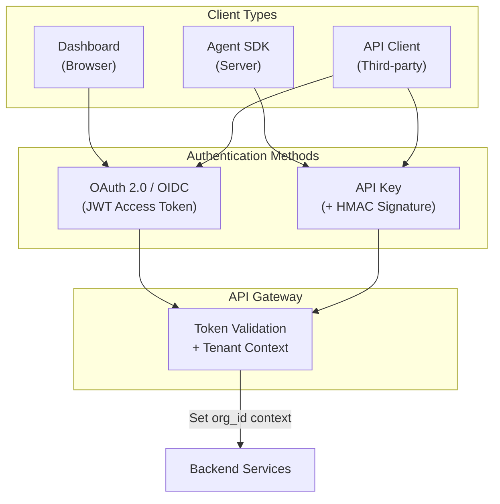

# AI Agent Analytics Platform - API Specification

**Version:** 1.2.0  
**Status:** Technical Specification  
**Last Updated:** December 2025  
**Authors:** Technical Architecture Team

---

## Table of Contents

1. [Executive Summary](#1-executive-summary)
2. [MVP Scope & Phased Delivery](#2-mvp-scope--phased-delivery)
3. [API Design Philosophy](#3-api-design-philosophy)
4. [Authentication & Authorization](#4-authentication--authorization)
5. [API Versioning Strategy](#5-api-versioning-strategy)
6. [Core API Endpoints](#6-core-api-endpoints)
7. [Real-Time APIs](#7-real-time-apis)
8. [Rate Limiting & Throttling](#8-rate-limiting--throttling)
9. [Error Handling](#9-error-handling)
10. [Pagination & Filtering](#10-pagination--filtering)
11. [OpenAPI 3.0 Specification (Single Source of Truth)](#11-openapi-30-specification-single-source-of-truth)
12. [SDK Design Guidelines](#12-sdk-design-guidelines)
13. [Graceful Degradation Strategy](#13-graceful-degradation-strategy)
14. [Service Level Agreements (SLAs)](#14-service-level-agreements-slas)
15. [Disaster Recovery Procedures](#15-disaster-recovery-procedures)
16. [Implementation Checklist](#16-implementation-checklist)

---

## 1. Executive Summary

### 1.1 Purpose

This document defines the complete API contract for the AI Agent Analytics Platform MVP. It serves as the authoritative source for:

- Frontend developers building the dashboard
- Backend developers implementing the API
- Agent SDK developers integrating event collection
- Third-party integrators building on the platform

### 1.2 Scope

| API Category | Endpoints | Purpose |
|--------------|-----------|---------|
| **Events API** | 4 endpoints | Ingest, query, and export analytics events |
| **Metrics API** | 6 endpoints | Pre-aggregated metrics for dashboards |
| **Sessions API** | 5 endpoints | Session-level analytics and replay |
| **Organizations API** | 4 endpoints | Tenant management and configuration |
| **Users API** | 5 endpoints | User management within organizations |
| **Real-Time API** | WebSocket | Live dashboard updates |

### 1.3 Key Design Decisions

| Decision | Choice | Rationale |
|----------|--------|-----------|
| **API Style** | REST + WebSocket | REST for CRUD, WebSocket for real-time; familiar to most developers |
| **Spec Format** | OpenAPI 3.0 | Industry standard, excellent tooling (codegen, docs, validation) |
| **Versioning** | URL path (`/v1/`) | Simple, explicit, cache-friendly |
| **Auth (Users)** | OAuth 2.0/OIDC (JWT) | Standard, supports SSO, stateless validation |
| **Auth (Agents)** | API Keys + HMAC | Simple for M2M, supports request signing |
| **Pagination** | Cursor-based | Handles real-time data, no offset drift |
| **Rate Limiting** | Token bucket | Flexible, handles bursts, per-tenant quotas |

---

## 2. MVP Scope & Phased Delivery

### 2.1 Phased API Delivery Overview

```
┌─────────────────────────────────────────────────────────────────────────────┐
│                       API Development Phases                                 │
├─────────────────────────────────────────────────────────────────────────────┤
│                                                                             │
│  Phase 1: MVP (Weeks 1-6)                                                   │
│  ════════════════════════                                                   │
│  Goal: Launch with core analytics functionality                             │
│  • Event ingestion (batch)                                                  │
│  • Dashboard metrics (overview, timeseries)                                 │
│  • Session list and detail                                                  │
│  • Basic authentication (API keys for agents, JWT for dashboard)           │
│  • Simple rate limiting                                                     │
│                                                                             │
│  Phase 2: Completeness (Weeks 7-12)                                        │
│  ══════════════════════════════════                                        │
│  Goal: Full feature parity with PRD                                        │
│  • Real-time WebSocket                                                     │
│  • Advanced queries and filtering                                          │
│  • User/org management APIs                                                │
│  • Data exports                                                            │
│  • Tiered rate limiting                                                    │
│                                                                             │
│  Phase 3: Scale & Enterprise (Weeks 13+)                                   │
│  ═══════════════════════════════════════                                   │
│  Goal: Enterprise-ready platform                                           │
│  • Multi-region deployment                                                 │
│  • Advanced SLAs                                                           │
│  • Full disaster recovery                                                  │
│  • SSO/SAML integration                                                    │
│  • Audit logging                                                           │
│                                                                             │
└─────────────────────────────────────────────────────────────────────────────┘
```

### 2.2 API Endpoints by Phase

| Endpoint | Phase 1 (MVP) | Phase 2 | Phase 3 | Notes |
|----------|:-------------:|:-------:|:-------:|-------|
| **Events API** |||||
| POST /v1/events | ✅ | | | Core ingestion |
| GET /v1/events | | ✅ | | Query events |
| POST /v1/events/query | | ✅ | | Complex queries |
| POST /v1/exports | | ✅ | | Data export |
| **Metrics API** |||||
| GET /v1/metrics/overview | ✅ | | | Dashboard KPIs |
| GET /v1/metrics/timeseries | ✅ | | | Charts |
| GET /v1/metrics/breakdown | | ✅ | | Drill-down |
| GET /v1/metrics/compare | | | ✅ | Period comparison |
| **Sessions API** |||||
| GET /v1/sessions | ✅ | | | Session list |
| GET /v1/sessions/{id} | ✅ | | | Session detail |
| GET /v1/sessions/{id}/events | | ✅ | | Session replay |
| POST /v1/sessions/query | | ✅ | | Complex queries |
| **Real-Time API** |||||
| WebSocket /v1/stream | | ✅ | | Live updates |
| SSE /v1/stream/sse | | | ✅ | Fallback |
| **Organization API** |||||
| GET /v1/organizations/current | ✅ | | | Basic org info |
| PUT /v1/organizations/current | | ✅ | | Org settings |
| GET /v1/organizations/current/usage | | ✅ | | Quota usage |
| **User API** |||||
| GET /v1/users | | ✅ | | List users |
| POST /v1/users | | ✅ | | Invite user |
| GET /v1/api-keys | ✅ | | | List API keys |
| POST /v1/api-keys | ✅ | | | Create API key |
| DELETE /v1/api-keys/{id} | | ✅ | | Revoke key |
| **Admin API** |||||
| GET /v1/admin/audit-logs | | | ✅ | Audit trail |
| GET /v1/admin/usage-reports | | | ✅ | Usage analytics |

### 2.3 Feature Capabilities by Phase

| Capability | Phase 1 (MVP) | Phase 2 | Phase 3 |
|------------|---------------|---------|---------|
| **Authentication** ||||
| API Key (agents) | ✅ Basic | ✅ + Rotation | ✅ + Scopes |
| JWT (dashboard) | ✅ Basic | ✅ + Refresh | ✅ + SSO/SAML |
| **Rate Limiting** ||||
| Global limits | ✅ Fixed | ✅ Tiered | ✅ Custom |
| Per-endpoint limits | ❌ | ✅ | ✅ |
| Burst handling | ❌ | ✅ | ✅ |
| **Error Handling** ||||
| Standard errors | ✅ | ✅ | ✅ |
| Detailed validation | ❌ | ✅ | ✅ |
| Request tracing | ✅ Basic | ✅ Full | ✅ + Distributed |
| **Caching** ||||
| Redis caching | ✅ Basic | ✅ Tiered TTL | ✅ + Invalidation |
| CDN caching | ❌ | ✅ | ✅ |
| **SLAs** ||||
| Availability | 99.5% | 99.9% | 99.99% |
| P95 Latency | < 1s | < 500ms | < 200ms |
| Support | Email | Business hours | 24/7 |

### 2.4 MVP Scope Boundaries

**In Scope for MVP (Phase 1):**
- Single-region deployment (us-east-1)
- Event ingestion with basic validation
- Pre-computed metrics (hourly aggregations)
- Session list with basic filtering (date, status)
- API key authentication for SDK
- JWT authentication for dashboard (via Cognito)
- Basic rate limiting (fixed limits per tier)
- Standard error responses
- Health check endpoint

**Explicitly Deferred to Phase 2+:**
- Real-time WebSocket updates
- Complex query builder
- Custom date range beyond 90 days
- Data export functionality
- User invitation and management
- Advanced filtering (by team, custom attributes)
- Tiered/dynamic rate limiting

**Explicitly Deferred to Phase 3+:**
- Multi-region active-active
- SSO/SAML federation
- Custom SLA agreements
- Audit logging API
- Data residency controls
- On-premise deployment option

---

## 3. API Design Philosophy

### 3.1 Design Principles

```
┌─────────────────────────────────────────────────────────────────────────────┐
│                           API Design Principles                              │
├─────────────────────────────────────────────────────────────────────────────┤
│                                                                             │
│  1. PREDICTABLE         Resource-oriented URLs, consistent naming           │
│                         GET /sessions/{id} not GET /getSession?id=          │
│                                                                             │
│  2. SECURE BY DEFAULT   Multi-tenant isolation, least privilege             │
│                         org_id always validated against token               │
│                                                                             │
│  3. FAST                <100ms P95 for dashboard queries                    │
│                         Caching headers, efficient pagination               │
│                                                                             │
│  4. OBSERVABLE          Request IDs, structured errors, metrics             │
│                         Every request traceable end-to-end                  │
│                                                                             │
│  5. EVOLVABLE           Versioned, additive changes, deprecation policy     │
│                         New fields don't break existing clients             │
│                                                                             │
└─────────────────────────────────────────────────────────────────────────────┘
```

### 3.2 URL Structure

```
https://api.analytics.example.com/v1/{resource}/{id}/{sub-resource}
       └─────────────┬─────────┘ └┬┘ └───┬───┘ └┬┘ └─────┬──────┘
                  Base URL      Version Resource  ID   Sub-resource

Examples:
  GET    /v1/sessions                    # List sessions
  GET    /v1/sessions/sess_abc123        # Get session details
  GET    /v1/sessions/sess_abc123/events # Get session events
  POST   /v1/events                      # Ingest events (batch)
  GET    /v1/metrics/overview            # Dashboard overview metrics
```

### 3.3 Resource Naming Conventions

| Convention | Example | Notes |
|------------|---------|-------|
| Plural nouns | `/sessions`, `/events` | Collections are plural |
| Lowercase | `/api-keys` not `/apiKeys` | URL-friendly |
| Hyphens | `/error-rates` not `/error_rates` | Readable in URLs |
| No verbs | `/sessions` not `/getSessions` | HTTP methods convey action |
| Nested max 2 levels | `/sessions/{id}/events` | Deeper = separate endpoint |

### 3.4 HTTP Methods

| Method | Idempotent | Safe | Use Case |
|--------|------------|------|----------|
| `GET` | ✅ | ✅ | Retrieve resources |
| `POST` | ❌ | ❌ | Create resources, complex queries |
| `PUT` | ✅ | ❌ | Full resource replacement |
| `PATCH` | ❌ | ❌ | Partial updates |
| `DELETE` | ✅ | ❌ | Remove resources |

---

## 4. Authentication & Authorization

### 4.1 Authentication Methods



### 4.2 OAuth 2.0 / OIDC (Dashboard Users)

**Flow: Authorization Code + PKCE**

```typescript
// 1. Client initiates login
const authUrl = new URL('https://auth.analytics.example.com/oauth2/authorize');
authUrl.searchParams.set('client_id', CLIENT_ID);
authUrl.searchParams.set('response_type', 'code');
authUrl.searchParams.set('redirect_uri', 'https://dashboard.example.com/callback');
authUrl.searchParams.set('scope', 'openid profile email analytics:read');
authUrl.searchParams.set('code_challenge', codeChallenge);
authUrl.searchParams.set('code_challenge_method', 'S256');
authUrl.searchParams.set('state', generateState());

// 2. After redirect, exchange code for tokens
const tokenResponse = await fetch('https://auth.analytics.example.com/oauth2/token', {
  method: 'POST',
  headers: { 'Content-Type': 'application/x-www-form-urlencoded' },
  body: new URLSearchParams({
    grant_type: 'authorization_code',
    code: authorizationCode,
    redirect_uri: 'https://dashboard.example.com/callback',
    client_id: CLIENT_ID,
    code_verifier: codeVerifier,
  }),
});

// 3. Use access token for API calls
const { access_token, refresh_token, id_token } = await tokenResponse.json();
```

**JWT Access Token Structure:**

```json
{
  "sub": "user_abc123",
  "iss": "https://auth.analytics.example.com",
  "aud": "https://api.analytics.example.com",
  "exp": 1703001600,
  "iat": 1703000700,
  "scope": "openid profile email analytics:read analytics:write",
  "custom:org_id": "org_xyz789",
  "custom:org_role": "admin",
  "custom:teams": ["team_frontend", "team_backend"],
  "custom:data_region": "us"
}
```

### 4.3 API Key Authentication (Agent SDK / M2M)

**API Key Format:**

```
ak_live_org_xyz789_k3j4h5g6f7d8s9a0
└┬┘ └─┬─┘ └───┬───┘ └───────┬──────┘
 │    │       │              │
Prefix Env   Org ID     Random (20 chars)
```

**Request Signing (HMAC-SHA256):**

```typescript
// Agent SDK signs requests for integrity
function signRequest(
  apiKey: string,
  apiSecret: string,
  method: string,
  path: string,
  body: string,
  timestamp: number
): string {
  const payload = `${timestamp}.${method}.${path}.${body}`;
  return crypto
    .createHmac('sha256', apiSecret)
    .update(payload)
    .digest('hex');
}

// Request headers
const headers = {
  'X-API-Key': apiKey,
  'X-Timestamp': timestamp.toString(),
  'X-Signature': signature,
  'Content-Type': 'application/json',
};
```

**API Key Validation Flow:**

```typescript
// Backend validation
async function validateApiKey(req: Request): Promise<AuthContext> {
  const apiKey = req.headers['x-api-key'];
  const timestamp = parseInt(req.headers['x-timestamp']);
  const signature = req.headers['x-signature'];
  
  // 1. Check timestamp freshness (5 min window)
  if (Math.abs(Date.now() - timestamp) > 300_000) {
    throw new UnauthorizedError('Request timestamp expired');
  }
  
  // 2. Look up API key
  const keyRecord = await db.query(
    'SELECT * FROM api_keys WHERE key_prefix = $1 AND active = true',
    [apiKey.substring(0, 32)]
  );
  
  if (!keyRecord) {
    throw new UnauthorizedError('Invalid API key');
  }
  
  // 3. Verify signature
  const expectedSig = signRequest(
    apiKey,
    keyRecord.secret_hash,
    req.method,
    req.path,
    JSON.stringify(req.body),
    timestamp
  );
  
  if (!crypto.timingSafeEqual(Buffer.from(signature), Buffer.from(expectedSig))) {
    throw new UnauthorizedError('Invalid signature');
  }
  
  // 4. Return auth context
  return {
    type: 'api_key',
    orgId: keyRecord.org_id,
    keyId: keyRecord.id,
    scopes: keyRecord.scopes,
  };
}
```

### 4.4 Authorization (RBAC)

**Scopes:**

| Scope | Description | Roles |
|-------|-------------|-------|
| `analytics:read` | Read dashboard data | All |
| `analytics:write` | Create reports, exports | User, Manager, Admin |
| `events:write` | Ingest events | Agent SDK only |
| `users:read` | View team members | Manager, Admin |
| `users:write` | Manage team members | Admin |
| `org:admin` | Org settings, billing | Admin |

**Permission Matrix:**

```typescript
const PERMISSIONS: Record<Role, Permission[]> = {
  viewer: [
    'analytics:read',
    'sessions:read:own',
  ],
  user: [
    'analytics:read',
    'analytics:write',
    'sessions:read:team',
    'exports:create:own',
  ],
  manager: [
    'analytics:read',
    'analytics:write',
    'sessions:read:all',
    'exports:create:team',
    'users:read',
  ],
  admin: [
    '*', // All permissions within org
  ],
};

// Authorization middleware
function authorize(requiredScope: string) {
  return async (req: Request, res: Response, next: NextFunction) => {
    const { scopes, orgRole } = req.auth;
    
    const hasScope = scopes.includes(requiredScope) || 
                     scopes.includes('*') ||
                     PERMISSIONS[orgRole]?.includes(requiredScope);
    
    if (!hasScope) {
      throw new ForbiddenError(`Missing required scope: ${requiredScope}`);
    }
    
    next();
  };
}
```

### 4.5 Multi-Tenant Isolation

```typescript
// CRITICAL: Every request must have tenant context
async function setTenantContext(req: Request): Promise<void> {
  const orgId = req.auth.orgId;
  
  // Validate org exists and is active
  const org = await cache.getOrSet(`org:${orgId}`, async () => {
    return db.query('SELECT * FROM organizations WHERE id = $1 AND status = $2', 
      [orgId, 'active']);
  }, { ttl: 300 });
  
  if (!org) {
    throw new ForbiddenError('Organization not found or inactive');
  }
  
  // Set PostgreSQL session variable for RLS
  await db.query("SELECT set_config('app.current_org_id', $1, true)", [orgId]);
  
  // Attach to request for use in handlers
  req.org = org;
}

// All queries automatically filtered by RLS
// SELECT * FROM sessions → SELECT * FROM sessions WHERE org_id = 'org_xyz789'
```

---

## 5. API Versioning Strategy

### 5.1 Versioning Approach

**URL Path Versioning** (chosen):

```
GET /v1/sessions
GET /v2/sessions  (future)
```

**Rationale:**

| Approach | Pros | Cons | Verdict |
|----------|------|------|---------|
| URL Path (`/v1/`) | Explicit, cache-friendly, easy routing | URL clutter | ✅ **Chosen** |
| Header (`Accept-Version`) | Clean URLs | Hidden, caching issues | ❌ |
| Query (`?version=1`) | Simple | Cache key complexity | ❌ |

### 5.2 Version Lifecycle

```
┌─────────────┐     ┌─────────────┐     ┌─────────────┐     ┌─────────────┐
│   Alpha     │────▶│    Beta     │────▶│   Stable    │────▶│ Deprecated  │
│  (v1-alpha) │     │  (v1-beta)  │     │    (v1)     │     │    (v1)     │
└─────────────┘     └─────────────┘     └─────────────┘     └──────┬──────┘
                                                                   │
    Breaking changes allowed    Feature complete    18 months      ▼
                                                    support    ┌─────────┐
                                                               │ Retired │
                                                               └─────────┘
```

### 5.3 Breaking vs Non-Breaking Changes

**Non-Breaking (OK to add):**
- New optional request parameters
- New response fields
- New endpoints
- New enum values (if client handles unknown)

**Breaking (Requires new version):**
- Removing/renaming fields
- Changing field types
- Changing URL structure
- Changing authentication
- Changing error formats

### 5.4 Deprecation Headers

```http
HTTP/1.1 200 OK
Deprecation: true
Sunset: Sat, 01 Jun 2026 00:00:00 GMT
Link: <https://api.analytics.example.com/v2/sessions>; rel="successor-version"
X-API-Warn: "Endpoint deprecated. Migrate to /v2/sessions by June 2026"
```

---

## 6. Core API Endpoints

### 6.1 Events API

#### POST /v1/events (Batch Ingest)

**Purpose:** Ingest analytics events from Agent SDK

```yaml
# Request
POST /v1/events
Content-Type: application/json
X-API-Key: ak_live_org_xyz789_...
X-Timestamp: 1703000700000
X-Signature: a1b2c3d4...

{
  "events": [
    {
      "event_id": "evt_01HGX5VBJX2Q8JYXMVQZRK3456",
      "event_type": "session_start",
      "timestamp": "2025-12-09T10:30:00.000Z",
      "session_id": "sess_01HGX5VBJX2Q8JYXMVQZRK1234",
      "user_id": "user_dev_alice",
      "agent_id": "agent_claude_code",
      "environment": "production",
      "metadata": {
        "agent_version": "1.2.3",
        "ide": "vscode",
        "os": "macos"
      }
    },
    {
      "event_id": "evt_01HGX5VBJX2Q8JYXMVQZRK3457",
      "event_type": "task_complete",
      "timestamp": "2025-12-09T10:35:00.000Z",
      "session_id": "sess_01HGX5VBJX2Q8JYXMVQZRK1234",
      "user_id": "user_dev_alice",
      "agent_id": "agent_claude_code",
      "environment": "production",
      "metadata": {
        "task_type": "code_generation",
        "tokens_input": 1500,
        "tokens_output": 3200,
        "duration_ms": 4500,
        "success": true
      }
    }
  ]
}

# Response (202 Accepted)
{
  "accepted": 2,
  "rejected": 0,
  "errors": [],
  "request_id": "req_01HGX5VBJX2Q8JYXMVQZRK9999"
}
```

**Validation Rules:**

```typescript
const eventSchema = z.object({
  event_id: z.string().regex(/^evt_[a-zA-Z0-9]{26}$/),
  event_type: z.enum([
    'session_start', 'session_end', 'session_pause', 'session_resume',
    'task_start', 'task_complete', 'task_error', 'task_cancel',
    'tool_call', 'tool_response',
    'error', 'warning',
    'feedback_positive', 'feedback_negative',
  ]),
  timestamp: z.string().datetime(),
  session_id: z.string().regex(/^sess_[a-zA-Z0-9]{26}$/),
  user_id: z.string().max(128),
  agent_id: z.string().max(64),
  environment: z.enum(['production', 'staging', 'development']).default('production'),
  metadata: z.record(z.unknown()).optional(),
}).strict();

const batchSchema = z.object({
  events: z.array(eventSchema).min(1).max(1000),
});
```

#### GET /v1/events (Query Events)

**Purpose:** Query raw events with filters

```yaml
# Request
GET /v1/events?start_time=2025-12-09T00:00:00Z&end_time=2025-12-09T23:59:59Z&event_type=error&limit=50
Authorization: Bearer eyJhbGc...

# Response
{
  "data": [
    {
      "event_id": "evt_01HGX5VBJX2Q8JYXMVQZRK3456",
      "event_type": "error",
      "timestamp": "2025-12-09T14:30:00.000Z",
      "session_id": "sess_01HGX5VBJX2Q8JYXMVQZRK1234",
      "user_id": "user_dev_bob",
      "agent_id": "agent_claude_code",
      "environment": "production",
      "metadata": {
        "error_code": "RATE_LIMIT_EXCEEDED",
        "error_message": "API rate limit exceeded",
        "stack_trace": "..."
      }
    }
  ],
  "pagination": {
    "cursor": "eyJsYXN0X2lkIjoiZXZ0XzAxSEdYNVZCSlgyUThKWVhNVlFaUkszNDU2In0=",
    "has_more": true,
    "total_estimate": 1247
  },
  "meta": {
    "request_id": "req_01HGX5VBJX2Q8JYXMVQZRK9999",
    "query_time_ms": 45
  }
}
```

**Query Parameters:**

| Parameter | Type | Required | Description |
|-----------|------|----------|-------------|
| `start_time` | ISO 8601 | ✅ | Start of time range |
| `end_time` | ISO 8601 | ✅ | End of time range |
| `event_type` | string[] | | Filter by event types |
| `session_id` | string | | Filter by session |
| `user_id` | string | | Filter by user |
| `agent_id` | string | | Filter by agent |
| `environment` | string | | Filter by environment |
| `limit` | int | | Max results (default: 100, max: 1000) |
| `cursor` | string | | Pagination cursor |

### 6.2 Metrics API

#### GET /v1/metrics/overview

**Purpose:** Dashboard overview metrics (cached, fast)

```yaml
# Request
GET /v1/metrics/overview?period=7d&compare=true
Authorization: Bearer eyJhbGc...

# Response
{
  "period": {
    "start": "2025-12-02T00:00:00Z",
    "end": "2025-12-09T00:00:00Z",
    "granularity": "day"
  },
  "metrics": {
    "active_users": {
      "value": 1247,
      "previous": 1189,
      "change_percent": 4.88,
      "trend": "up"
    },
    "total_sessions": {
      "value": 8934,
      "previous": 8201,
      "change_percent": 8.94,
      "trend": "up"
    },
    "success_rate": {
      "value": 94.7,
      "previous": 93.2,
      "change_percent": 1.61,
      "trend": "up",
      "unit": "percent"
    },
    "avg_session_duration": {
      "value": 1847,
      "previous": 1723,
      "change_percent": 7.20,
      "trend": "up",
      "unit": "seconds"
    },
    "total_cost": {
      "value": 12450.75,
      "previous": 11892.30,
      "change_percent": 4.70,
      "trend": "up",
      "unit": "usd"
    },
    "error_count": {
      "value": 234,
      "previous": 287,
      "change_percent": -18.47,
      "trend": "down"
    }
  },
  "meta": {
    "cache_hit": true,
    "cache_ttl": 60,
    "request_id": "req_..."
  }
}
```

#### GET /v1/metrics/timeseries

**Purpose:** Time-series data for charts

```yaml
# Request
GET /v1/metrics/timeseries?metric=active_users&period=30d&granularity=day
Authorization: Bearer eyJhbGc...

# Response
{
  "metric": "active_users",
  "period": {
    "start": "2025-11-09T00:00:00Z",
    "end": "2025-12-09T00:00:00Z"
  },
  "granularity": "day",
  "data": [
    { "timestamp": "2025-11-09T00:00:00Z", "value": 1102 },
    { "timestamp": "2025-11-10T00:00:00Z", "value": 1089 },
    { "timestamp": "2025-11-11T00:00:00Z", "value": 1156 },
    // ... 30 data points
    { "timestamp": "2025-12-08T00:00:00Z", "value": 1247 }
  ],
  "aggregations": {
    "min": 1023,
    "max": 1312,
    "avg": 1167.4,
    "sum": 35022,
    "p50": 1156,
    "p95": 1289
  }
}
```

**Available Metrics:**

| Metric | Description | Granularities |
|--------|-------------|---------------|
| `active_users` | Unique users with sessions | hour, day, week |
| `total_sessions` | Session count | hour, day, week |
| `session_duration` | Avg session length (sec) | hour, day, week |
| `success_rate` | Task success % | hour, day, week |
| `error_rate` | Error % | hour, day, week |
| `tokens_used` | Total tokens consumed | hour, day, week |
| `cost` | Estimated cost (USD) | hour, day, week |
| `latency_p50` | 50th percentile latency | hour, day |
| `latency_p95` | 95th percentile latency | hour, day |
| `latency_p99` | 99th percentile latency | hour, day |

#### GET /v1/metrics/breakdown

**Purpose:** Breakdown by dimension (for pie/bar charts)

```yaml
# Request
GET /v1/metrics/breakdown?metric=sessions&dimension=agent_id&period=7d&limit=10
Authorization: Bearer eyJhbGc...

# Response
{
  "metric": "sessions",
  "dimension": "agent_id",
  "period": {
    "start": "2025-12-02T00:00:00Z",
    "end": "2025-12-09T00:00:00Z"
  },
  "data": [
    { "key": "agent_claude_code", "value": 4521, "percent": 50.6 },
    { "key": "agent_copilot", "value": 2134, "percent": 23.9 },
    { "key": "agent_cursor", "value": 1456, "percent": 16.3 },
    { "key": "agent_other", "value": 823, "percent": 9.2 }
  ],
  "total": 8934
}
```

**Available Dimensions:**

- `agent_id` - By AI agent
- `user_id` - By user (top N)
- `team_id` - By team
- `environment` - By environment
- `error_code` - By error type
- `task_type` - By task category

### 6.3 Sessions API

#### GET /v1/sessions

**Purpose:** List sessions with filters

```yaml
# Request
GET /v1/sessions?start_time=2025-12-09T00:00:00Z&status=active&sort=-started_at&limit=25
Authorization: Bearer eyJhbGc...

# Response
{
  "data": [
    {
      "session_id": "sess_01HGX5VBJX2Q8JYXMVQZRK1234",
      "user_id": "user_dev_alice",
      "user": {
        "name": "Alice Chen",
        "email": "alice@example.com",
        "avatar_url": "https://..."
      },
      "agent_id": "agent_claude_code",
      "environment": "production",
      "status": "active",
      "started_at": "2025-12-09T10:30:00.000Z",
      "ended_at": null,
      "duration_seconds": null,
      "metrics": {
        "tasks_completed": 12,
        "tasks_failed": 1,
        "tokens_used": 45000,
        "estimated_cost": 0.85
      }
    }
  ],
  "pagination": {
    "cursor": "...",
    "has_more": true
  }
}
```

#### GET /v1/sessions/{session_id}

**Purpose:** Get detailed session info

```yaml
# Request
GET /v1/sessions/sess_01HGX5VBJX2Q8JYXMVQZRK1234
Authorization: Bearer eyJhbGc...

# Response
{
  "session_id": "sess_01HGX5VBJX2Q8JYXMVQZRK1234",
  "user_id": "user_dev_alice",
  "user": {
    "name": "Alice Chen",
    "email": "alice@example.com",
    "team_id": "team_frontend"
  },
  "agent_id": "agent_claude_code",
  "agent": {
    "name": "Claude Code",
    "version": "1.2.3"
  },
  "environment": "production",
  "status": "completed",
  "started_at": "2025-12-09T10:30:00.000Z",
  "ended_at": "2025-12-09T11:15:00.000Z",
  "duration_seconds": 2700,
  "client_info": {
    "ide": "vscode",
    "ide_version": "1.85.0",
    "os": "macos",
    "os_version": "14.1"
  },
  "metrics": {
    "tasks_completed": 15,
    "tasks_failed": 2,
    "tasks_cancelled": 1,
    "tokens_input": 25000,
    "tokens_output": 62000,
    "estimated_cost": 1.45,
    "avg_task_duration_ms": 3200
  },
  "timeline": {
    "event_count": 156,
    "first_event": "2025-12-09T10:30:00.000Z",
    "last_event": "2025-12-09T11:15:00.000Z"
  }
}
```

#### GET /v1/sessions/{session_id}/events

**Purpose:** Get session event timeline (for replay)

```yaml
# Request
GET /v1/sessions/sess_01HGX5VBJX2Q8JYXMVQZRK1234/events?limit=100
Authorization: Bearer eyJhbGc...

# Response
{
  "session_id": "sess_01HGX5VBJX2Q8JYXMVQZRK1234",
  "events": [
    {
      "event_id": "evt_...",
      "event_type": "session_start",
      "timestamp": "2025-12-09T10:30:00.000Z",
      "relative_time_ms": 0,
      "metadata": {}
    },
    {
      "event_id": "evt_...",
      "event_type": "task_start",
      "timestamp": "2025-12-09T10:30:05.000Z",
      "relative_time_ms": 5000,
      "metadata": {
        "task_type": "code_generation",
        "prompt_preview": "Create a function that..."
      }
    }
    // ...
  ],
  "pagination": {
    "cursor": "...",
    "has_more": true
  }
}
```

### 6.4 Organizations API

#### GET /v1/organizations/current

**Purpose:** Get current org details

```yaml
# Request
GET /v1/organizations/current
Authorization: Bearer eyJhbGc...

# Response
{
  "id": "org_xyz789",
  "name": "Acme Corp",
  "slug": "acme-corp",
  "plan": "professional",
  "status": "active",
  "settings": {
    "data_region": "us",
    "retention_days": 365,
    "sso_enabled": true,
    "sso_provider": "okta"
  },
  "quotas": {
    "events_per_month": 100000000,
    "events_used": 45678901,
    "api_keys": 50,
    "api_keys_used": 12,
    "users": 100,
    "users_active": 47
  },
  "created_at": "2025-01-15T00:00:00Z"
}
```

#### GET /v1/organizations/current/usage

**Purpose:** Billing/quota usage

```yaml
# Request
GET /v1/organizations/current/usage?period=current_month
Authorization: Bearer eyJhbGc...

# Response
{
  "period": {
    "start": "2025-12-01T00:00:00Z",
    "end": "2025-12-31T23:59:59Z",
    "type": "current_month"
  },
  "usage": {
    "events_ingested": 45678901,
    "events_limit": 100000000,
    "events_percent": 45.68,
    "storage_gb": 234.5,
    "storage_limit_gb": 500,
    "api_requests": 12345678,
    "compute_hours": 456.7
  },
  "cost": {
    "base_plan": 2000.00,
    "overage": 0,
    "total": 2000.00,
    "currency": "USD"
  }
}
```

### 6.5 Users API

#### GET /v1/users

**Purpose:** List organization users

```yaml
# Request
GET /v1/users?role=admin&status=active&limit=50
Authorization: Bearer eyJhbGc...

# Response
{
  "data": [
    {
      "id": "user_abc123",
      "email": "alice@example.com",
      "name": "Alice Chen",
      "role": "admin",
      "status": "active",
      "teams": ["team_frontend", "team_leads"],
      "last_active_at": "2025-12-09T10:30:00Z",
      "created_at": "2025-06-01T00:00:00Z"
    }
  ],
  "pagination": { "cursor": "...", "has_more": false }
}
```

### 6.6 API Keys API

#### GET /v1/api-keys

**Purpose:** List API keys for organization

```yaml
# Request
GET /v1/api-keys
Authorization: Bearer eyJhbGc...

# Response
{
  "data": [
    {
      "id": "key_abc123",
      "name": "Production Agent SDK",
      "prefix": "ak_live_org_xyz789_k3j4",
      "scopes": ["events:write"],
      "environment": "production",
      "last_used_at": "2025-12-09T10:30:00Z",
      "created_at": "2025-06-01T00:00:00Z",
      "created_by": {
        "id": "user_abc123",
        "name": "Alice Chen"
      }
    }
  ]
}
```

#### POST /v1/api-keys

**Purpose:** Create new API key

```yaml
# Request
POST /v1/api-keys
Authorization: Bearer eyJhbGc...
Content-Type: application/json

{
  "name": "Staging Agent SDK",
  "scopes": ["events:write"],
  "environment": "staging",
  "expires_at": "2026-12-09T00:00:00Z"
}

# Response (201 Created)
{
  "id": "key_def456",
  "name": "Staging Agent SDK",
  "key": "ak_test_org_xyz789_m4n5o6p7q8r9s0t1",
  "secret": "sk_test_a1b2c3d4e5f6g7h8i9j0k1l2m3n4o5p6",
  "scopes": ["events:write"],
  "environment": "staging",
  "expires_at": "2026-12-09T00:00:00Z",
  "created_at": "2025-12-09T10:30:00Z",
  "_warning": "Store the secret securely. It cannot be retrieved again."
}
```

---

## 7. Real-Time APIs

### 7.1 WebSocket Connection

**Endpoint:** `wss://ws.analytics.example.com/v1/stream`

```typescript
// Client connection
const ws = new WebSocket(
  `wss://ws.analytics.example.com/v1/stream?token=${accessToken}`
);

ws.onopen = () => {
  // Subscribe to channels
  ws.send(JSON.stringify({
    type: 'subscribe',
    channels: ['metrics:overview', 'sessions:active', 'alerts:critical']
  }));
};

ws.onmessage = (event) => {
  const message = JSON.parse(event.data);
  
  switch (message.type) {
    case 'metrics:update':
      updateDashboardMetrics(message.data);
      break;
    case 'session:started':
      addActiveSession(message.data);
      break;
    case 'session:ended':
      removeActiveSession(message.data.session_id);
      break;
    case 'alert:triggered':
      showAlert(message.data);
      break;
  }
};
```

### 7.2 WebSocket Message Types

**Server → Client:**

```typescript
// Metrics update (every 10s)
{
  "type": "metrics:update",
  "channel": "metrics:overview",
  "timestamp": "2025-12-09T10:30:10Z",
  "data": {
    "active_users": 1248,
    "active_sessions": 342,
    "events_per_second": 856,
    "error_rate": 0.5
  }
}

// Session started
{
  "type": "session:started",
  "channel": "sessions:active",
  "timestamp": "2025-12-09T10:30:15Z",
  "data": {
    "session_id": "sess_...",
    "user_id": "user_...",
    "user_name": "Alice Chen",
    "agent_id": "agent_claude_code"
  }
}

// Alert triggered
{
  "type": "alert:triggered",
  "channel": "alerts:critical",
  "timestamp": "2025-12-09T10:30:20Z",
  "data": {
    "alert_id": "alert_...",
    "severity": "critical",
    "title": "Error rate spike detected",
    "message": "Error rate increased to 5.2% (threshold: 5%)",
    "metric": "error_rate",
    "value": 5.2,
    "threshold": 5.0
  }
}
```

**Client → Server:**

```typescript
// Subscribe to channels
{
  "type": "subscribe",
  "channels": ["metrics:overview", "sessions:active"]
}

// Unsubscribe
{
  "type": "unsubscribe",
  "channels": ["sessions:active"]
}

// Ping (keep-alive)
{
  "type": "ping",
  "timestamp": 1703152200000
}
```

### 7.3 Server-Sent Events (SSE) Alternative

For simpler real-time needs, SSE is also supported:

```typescript
// Client
const eventSource = new EventSource(
  '/v1/stream/metrics?token=' + accessToken
);

eventSource.addEventListener('metrics:update', (event) => {
  const data = JSON.parse(event.data);
  updateDashboard(data);
});
```

---

## 8. Rate Limiting & Throttling

### 8.1 Rate Limit Tiers

| Tier | Requests/min | Burst | Events/sec | Use Case |
|------|--------------|-------|------------|----------|
| **Free** | 60 | 10 | 100 | Trial accounts |
| **Starter** | 300 | 50 | 1,000 | Small teams |
| **Professional** | 1,000 | 200 | 10,000 | Growing teams |
| **Enterprise** | 10,000 | 2,000 | 100,000 | Large orgs |

### 8.2 Rate Limit Headers

```http
HTTP/1.1 200 OK
X-RateLimit-Limit: 1000
X-RateLimit-Remaining: 847
X-RateLimit-Reset: 1703152260
X-RateLimit-Policy: "1000;w=60"
```

### 8.3 Rate Limit Response

```http
HTTP/1.1 429 Too Many Requests
Retry-After: 30
Content-Type: application/json

{
  "error": {
    "code": "RATE_LIMIT_EXCEEDED",
    "message": "Rate limit exceeded. Retry after 30 seconds.",
    "details": {
      "limit": 1000,
      "remaining": 0,
      "reset_at": "2025-12-09T10:31:00Z",
      "retry_after": 30
    }
  },
  "request_id": "req_..."
}
```

### 8.4 Implementation (Token Bucket)

```typescript
// Redis-based token bucket
class RateLimiter {
  constructor(private redis: Redis) {}
  
  async checkLimit(
    key: string,
    limit: number,
    windowSeconds: number
  ): Promise<RateLimitResult> {
    const now = Date.now();
    const windowKey = `ratelimit:${key}:${Math.floor(now / (windowSeconds * 1000))}`;
    
    const multi = this.redis.multi();
    multi.incr(windowKey);
    multi.expire(windowKey, windowSeconds);
    
    const [count] = await multi.exec();
    
    return {
      allowed: count <= limit,
      remaining: Math.max(0, limit - count),
      resetAt: new Date(Math.ceil(now / (windowSeconds * 1000)) * windowSeconds * 1000),
    };
  }
}

// Middleware
async function rateLimitMiddleware(req: Request, res: Response, next: NextFunction) {
  const orgId = req.auth.orgId;
  const tier = req.org.plan;
  const limits = RATE_LIMITS[tier];
  
  const result = await rateLimiter.checkLimit(
    `org:${orgId}`,
    limits.requestsPerMinute,
    60
  );
  
  res.setHeader('X-RateLimit-Limit', limits.requestsPerMinute);
  res.setHeader('X-RateLimit-Remaining', result.remaining);
  res.setHeader('X-RateLimit-Reset', Math.floor(result.resetAt.getTime() / 1000));
  
  if (!result.allowed) {
    throw new RateLimitError('Rate limit exceeded', result);
  }
  
  next();
}
```

---

## 9. Error Handling

### 9.1 Error Response Format

```typescript
interface ErrorResponse {
  error: {
    code: string;           // Machine-readable error code
    message: string;        // Human-readable message
    details?: Record<string, unknown>;  // Additional context
    field?: string;         // For validation errors
    documentation_url?: string;
  };
  request_id: string;       // For support/debugging
}
```

### 9.2 HTTP Status Codes

| Code | Meaning | When to Use |
|------|---------|-------------|
| `200` | OK | Successful GET, PUT, PATCH |
| `201` | Created | Successful POST (resource created) |
| `202` | Accepted | Async operation queued |
| `204` | No Content | Successful DELETE |
| `400` | Bad Request | Invalid request syntax/params |
| `401` | Unauthorized | Missing/invalid auth |
| `403` | Forbidden | Valid auth, insufficient perms |
| `404` | Not Found | Resource doesn't exist |
| `409` | Conflict | Resource state conflict |
| `422` | Unprocessable Entity | Validation failed |
| `429` | Too Many Requests | Rate limit exceeded |
| `500` | Internal Server Error | Unexpected server error |
| `503` | Service Unavailable | Maintenance/overload |

### 9.3 Error Code Catalog

```typescript
const ERROR_CODES = {
  // Authentication (AUTH_*)
  AUTH_TOKEN_MISSING: 'Missing authorization token',
  AUTH_TOKEN_INVALID: 'Invalid or expired token',
  AUTH_TOKEN_EXPIRED: 'Token has expired',
  AUTH_INSUFFICIENT_SCOPE: 'Token missing required scope',
  AUTH_API_KEY_INVALID: 'Invalid API key',
  AUTH_SIGNATURE_INVALID: 'Invalid request signature',
  
  // Authorization (AUTHZ_*)
  AUTHZ_FORBIDDEN: 'Access denied to this resource',
  AUTHZ_ORG_MISMATCH: 'Resource belongs to different organization',
  AUTHZ_ROLE_REQUIRED: 'Operation requires elevated role',
  
  // Validation (VAL_*)
  VAL_REQUIRED_FIELD: 'Required field missing',
  VAL_INVALID_FORMAT: 'Field format invalid',
  VAL_OUT_OF_RANGE: 'Value out of allowed range',
  VAL_INVALID_ENUM: 'Value not in allowed set',
  
  // Resource (RES_*)
  RES_NOT_FOUND: 'Resource not found',
  RES_ALREADY_EXISTS: 'Resource already exists',
  RES_CONFLICT: 'Resource state conflict',
  
  // Rate Limiting (RATE_*)
  RATE_LIMIT_EXCEEDED: 'Rate limit exceeded',
  RATE_QUOTA_EXCEEDED: 'Monthly quota exceeded',
  
  // Server (SRV_*)
  SRV_INTERNAL_ERROR: 'Internal server error',
  SRV_UNAVAILABLE: 'Service temporarily unavailable',
  SRV_TIMEOUT: 'Request timeout',
};
```

### 9.4 Error Examples

**Validation Error (422):**

```json
{
  "error": {
    "code": "VAL_INVALID_FORMAT",
    "message": "Validation failed",
    "details": {
      "errors": [
        {
          "field": "events[0].timestamp",
          "message": "Must be valid ISO 8601 datetime",
          "received": "2025-13-45"
        },
        {
          "field": "events[0].event_type",
          "message": "Must be one of: session_start, session_end, ...",
          "received": "invalid_type"
        }
      ]
    }
  },
  "request_id": "req_01HGX5VBJX2Q8JYXMVQZRK9999"
}
```

**Authentication Error (401):**

```json
{
  "error": {
    "code": "AUTH_TOKEN_EXPIRED",
    "message": "Your access token has expired. Please refresh your token.",
    "documentation_url": "https://docs.example.com/auth/refresh-tokens"
  },
  "request_id": "req_..."
}
```

---

## 10. Pagination & Filtering

### 10.1 Cursor-Based Pagination

**Why Cursor over Offset:**

| Aspect | Cursor | Offset |
|--------|--------|--------|
| Real-time data | ✅ Stable | ❌ Drift issues |
| Performance | ✅ O(1) | ❌ O(n) for deep pages |
| Infinite scroll | ✅ Ideal | ❌ Problematic |
| "Jump to page N" | ❌ Not supported | ✅ Supported |

**Implementation:**

```typescript
// Cursor is base64-encoded JSON
interface Cursor {
  last_id: string;
  last_timestamp: string;
}

function encodeCursor(cursor: Cursor): string {
  return Buffer.from(JSON.stringify(cursor)).toString('base64url');
}

function decodeCursor(encoded: string): Cursor {
  return JSON.parse(Buffer.from(encoded, 'base64url').toString());
}

// Query with cursor
async function listSessions(params: {
  limit: number;
  cursor?: string;
  filters: SessionFilters;
}): Promise<PaginatedResponse<Session>> {
  const { limit, cursor, filters } = params;
  
  let query = db
    .select('*')
    .from('sessions')
    .where('org_id', '=', currentOrgId());
  
  // Apply filters
  if (filters.status) {
    query = query.where('status', '=', filters.status);
  }
  
  // Apply cursor
  if (cursor) {
    const { last_id, last_timestamp } = decodeCursor(cursor);
    query = query.where(
      (qb) => qb
        .where('started_at', '<', last_timestamp)
        .orWhere((qb2) => qb2
          .where('started_at', '=', last_timestamp)
          .where('id', '<', last_id)
        )
    );
  }
  
  // Fetch limit + 1 to determine has_more
  const rows = await query
    .orderBy('started_at', 'desc')
    .orderBy('id', 'desc')
    .limit(limit + 1);
  
  const hasMore = rows.length > limit;
  const data = hasMore ? rows.slice(0, -1) : rows;
  
  const nextCursor = hasMore && data.length > 0
    ? encodeCursor({
        last_id: data[data.length - 1].id,
        last_timestamp: data[data.length - 1].started_at,
      })
    : null;
  
  return {
    data,
    pagination: {
      cursor: nextCursor,
      has_more: hasMore,
    },
  };
}
```

### 10.2 Filtering Syntax

**Simple Filters (Query Params):**

```
GET /v1/sessions?status=active&agent_id=agent_claude_code
```

**Complex Filters (POST with Body):**

```yaml
POST /v1/sessions/query
Content-Type: application/json

{
  "filters": {
    "and": [
      { "field": "status", "op": "eq", "value": "completed" },
      { "field": "duration_seconds", "op": "gt", "value": 300 },
      {
        "or": [
          { "field": "agent_id", "op": "eq", "value": "agent_claude_code" },
          { "field": "agent_id", "op": "eq", "value": "agent_copilot" }
        ]
      }
    ]
  },
  "sort": [
    { "field": "started_at", "order": "desc" }
  ],
  "limit": 50
}
```

**Supported Operators:**

| Operator | Description | Example |
|----------|-------------|---------|
| `eq` | Equals | `{"field": "status", "op": "eq", "value": "active"}` |
| `ne` | Not equals | `{"field": "status", "op": "ne", "value": "cancelled"}` |
| `gt` | Greater than | `{"field": "duration", "op": "gt", "value": 300}` |
| `gte` | Greater than or equal | `{"field": "duration", "op": "gte", "value": 300}` |
| `lt` | Less than | `{"field": "cost", "op": "lt", "value": 10}` |
| `lte` | Less than or equal | `{"field": "cost", "op": "lte", "value": 10}` |
| `in` | In array | `{"field": "status", "op": "in", "value": ["active", "paused"]}` |
| `contains` | String contains | `{"field": "user_name", "op": "contains", "value": "alice"}` |
| `between` | Range | `{"field": "created_at", "op": "between", "value": ["2025-01-01", "2025-12-31"]}` |

---

## 11. OpenAPI 3.0 Specification (Single Source of Truth)

### 11.1 Spec-Driven Development Philosophy

The OpenAPI specification is the **single source of truth** for all API development. This spec-first approach enables:

```
┌─────────────────────────────────────────────────────────────────────────────┐
│                    OpenAPI as Single Source of Truth                         │
├─────────────────────────────────────────────────────────────────────────────┤
│                                                                             │
│                          ┌─────────────────┐                                │
│                          │   openapi.yaml  │                                │
│                          │  (Source of     │                                │
│                          │    Truth)       │                                │
│                          └────────┬────────┘                                │
│                                   │                                         │
│          ┌────────────────────────┼────────────────────────┐               │
│          │                        │                        │               │
│          ▼                        ▼                        ▼               │
│  ┌───────────────┐      ┌─────────────────┐      ┌─────────────────┐      │
│  │ Client SDKs   │      │   API Docs      │      │  Test Suites    │      │
│  │ (Generated)   │      │   (Generated)   │      │  (Generated)    │      │
│  │               │      │                 │      │                 │      │
│  │ • TypeScript  │      │ • Swagger UI    │      │ • Contract      │      │
│  │ • Python      │      │ • Redoc         │      │ • Integration   │      │
│  │ • Go          │      │ • Postman       │      │ • Mock servers  │      │
│  └───────────────┘      └─────────────────┘      └─────────────────┘      │
│          │                        │                        │               │
│          │                        │                        │               │
│          ▼                        ▼                        ▼               │
│  ┌───────────────┐      ┌─────────────────┐      ┌─────────────────┐      │
│  │ AI Assistants │      │   Validation    │      │  API Gateway    │      │
│  │ (Context)     │      │   Middleware    │      │  Config         │      │
│  │               │      │                 │      │                 │      │
│  │ • Claude      │      │ • Request       │      │ • Routes        │      │
│  │ • Copilot     │      │ • Response      │      │ • Rate limits   │      │
│  │ • Cursor      │      │ • Schema        │      │ • CORS          │      │
│  └───────────────┘      └─────────────────┘      └─────────────────┘      │
│                                                                             │
└─────────────────────────────────────────────────────────────────────────────┘
```

**Benefits of Spec-First Development:**

| Benefit | Description |
|---------|-------------|
| **Consistency** | All artifacts (docs, SDKs, tests) are always in sync |
| **AI-Assisted Development** | LLMs can read the spec and generate accurate code |
| **Contract Testing** | Auto-generate tests that validate API contract compliance |
| **Parallel Development** | Frontend and backend teams work from same contract |
| **Documentation** | Always up-to-date, generated from spec |
| **Validation** | Request/response validation derived from schema |

### 11.2 AI-First Development Workflow

The OpenAPI spec enables efficient AI-assisted engineering:

```typescript
// Example: Using OpenAPI spec with AI assistants

// 1. Load spec into AI context
const spec = await loadOpenAPISpec('./openapi.yaml');

// 2. AI can now:
//    - Generate type-safe client code
//    - Write tests that match the contract
//    - Implement handlers that match schemas
//    - Suggest API improvements
//    - Debug integration issues

// 3. Prompt example for Claude/GPT:
const prompt = `
Given this OpenAPI spec:
${JSON.stringify(spec.paths['/v1/events'], null, 2)}

Generate a TypeScript function that:
1. Calls POST /v1/events with proper types
2. Handles all documented error codes
3. Implements retry logic for 429/503
`;
```

**AI Development Integration Points:**

| Tool | Integration | Benefit |
|------|-------------|---------|
| **Claude/GPT** | Spec in system prompt | Accurate code generation |
| **Cursor** | Spec in workspace | Context-aware completions |
| **GitHub Copilot** | Spec comments in code | Type-aware suggestions |
| **Prism** | Mock server from spec | Frontend dev without backend |

### 11.3 Automated Toolchain

```yaml
# .github/workflows/api-spec.yml
name: API Spec Pipeline

on:
  push:
    paths: ['api/**/*.yaml']

jobs:
  validate:
    runs-on: ubuntu-latest
    steps:
      - uses: actions/checkout@v4
      
      - name: Validate OpenAPI Spec
        run: npx @redocly/cli lint api/openapi.yaml
        
      - name: Check Breaking Changes
        run: npx @redocly/cli diff api/openapi.yaml --fail-on-incompatible
        
  generate:
    needs: validate
    runs-on: ubuntu-latest
    steps:
      - name: Generate TypeScript Client
        run: |
          npx openapi-typescript api/openapi.yaml -o packages/sdk/src/api.d.ts
          npx orval --config orval.config.ts
          
      - name: Generate Python Client
        run: |
          npx @openapitools/openapi-generator-cli generate \
            -i api/openapi.yaml \
            -g python \
            -o sdk/python
            
      - name: Generate API Documentation
        run: npx @redocly/cli build-docs api/openapi.yaml -o docs/api.html
        
      - name: Generate Contract Tests
        run: npx dredd api/openapi.yaml http://localhost:3001
```

### 11.4 Specification File Structure

```
api/
├── openapi.yaml              # Main spec file
├── paths/
│   ├── events.yaml
│   ├── metrics.yaml
│   ├── sessions.yaml
│   ├── organizations.yaml
│   ├── users.yaml
│   └── api-keys.yaml
├── components/
│   ├── schemas/
│   │   ├── Event.yaml
│   │   ├── Session.yaml
│   │   ├── Metric.yaml
│   │   └── Error.yaml
│   ├── parameters/
│   │   ├── pagination.yaml
│   │   └── filters.yaml
│   ├── responses/
│   │   └── errors.yaml
│   └── securitySchemes.yaml
└── examples/
    ├── events/
    └── sessions/
```

### 11.5 Core OpenAPI Specification

```yaml
# openapi.yaml
openapi: 3.0.3
info:
  title: AI Agent Analytics Platform API
  description: |
    REST API for the AI Agent Analytics Platform.
    
    ## Authentication
    - **Dashboard Users**: OAuth 2.0 / OIDC (Bearer JWT)
    - **Agent SDK**: API Key + HMAC Signature
    
    ## Rate Limits
    See [Rate Limiting](#section/Rate-Limiting) for tier details.
    
    ## Environments
    - Production: `https://api.analytics.example.com`
    - Staging: `https://api.staging.analytics.example.com`
  version: 1.0.0
  contact:
    name: API Support
    email: api-support@example.com
    url: https://docs.example.com
  license:
    name: Proprietary
    url: https://example.com/terms

servers:
  - url: https://api.analytics.example.com/v1
    description: Production
  - url: https://api.staging.analytics.example.com/v1
    description: Staging

security:
  - BearerAuth: []
  - ApiKeyAuth: []

tags:
  - name: Events
    description: Event ingestion and querying
  - name: Metrics
    description: Pre-aggregated metrics for dashboards
  - name: Sessions
    description: Session-level analytics
  - name: Organizations
    description: Tenant management
  - name: Users
    description: User management
  - name: API Keys
    description: API key management

paths:
  # Events
  /events:
    post:
      tags: [Events]
      operationId: ingestEvents
      summary: Ingest events (batch)
      description: |
        Ingest up to 1000 analytics events in a single request.
        Used by Agent SDK for event collection.
      security:
        - ApiKeyAuth: []
      requestBody:
        required: true
        content:
          application/json:
            schema:
              $ref: '#/components/schemas/EventBatchRequest'
            example:
              events:
                - event_id: "evt_01HGX5VBJX2Q8JYXMVQZRK3456"
                  event_type: "session_start"
                  timestamp: "2025-12-09T10:30:00.000Z"
                  session_id: "sess_01HGX5VBJX2Q8JYXMVQZRK1234"
                  user_id: "user_dev_alice"
                  agent_id: "agent_claude_code"
                  environment: "production"
                  metadata:
                    agent_version: "1.2.3"
      responses:
        '202':
          description: Events accepted for processing
          content:
            application/json:
              schema:
                $ref: '#/components/schemas/EventBatchResponse'
        '400':
          $ref: '#/components/responses/BadRequest'
        '401':
          $ref: '#/components/responses/Unauthorized'
        '422':
          $ref: '#/components/responses/ValidationError'
        '429':
          $ref: '#/components/responses/RateLimited'

    get:
      tags: [Events]
      operationId: queryEvents
      summary: Query events
      description: Query raw events with filters
      parameters:
        - $ref: '#/components/parameters/StartTime'
        - $ref: '#/components/parameters/EndTime'
        - name: event_type
          in: query
          schema:
            type: array
            items:
              $ref: '#/components/schemas/EventType'
          style: form
          explode: true
        - name: session_id
          in: query
          schema:
            type: string
        - name: user_id
          in: query
          schema:
            type: string
        - $ref: '#/components/parameters/Limit'
        - $ref: '#/components/parameters/Cursor'
      responses:
        '200':
          description: Events matching query
          content:
            application/json:
              schema:
                $ref: '#/components/schemas/EventListResponse'

  # Metrics
  /metrics/overview:
    get:
      tags: [Metrics]
      operationId: getMetricsOverview
      summary: Get overview metrics
      description: Dashboard overview metrics with comparison
      parameters:
        - name: period
          in: query
          required: true
          schema:
            type: string
            enum: [1d, 7d, 30d, 90d]
          description: Time period for metrics
        - name: compare
          in: query
          schema:
            type: boolean
            default: true
          description: Include comparison with previous period
      responses:
        '200':
          description: Overview metrics
          content:
            application/json:
              schema:
                $ref: '#/components/schemas/MetricsOverviewResponse'

  /metrics/timeseries:
    get:
      tags: [Metrics]
      operationId: getMetricsTimeseries
      summary: Get timeseries metrics
      description: Time-series data for charts
      parameters:
        - name: metric
          in: query
          required: true
          schema:
            $ref: '#/components/schemas/MetricName'
        - name: period
          in: query
          required: true
          schema:
            type: string
            enum: [1d, 7d, 30d, 90d]
        - name: granularity
          in: query
          schema:
            type: string
            enum: [hour, day, week]
            default: day
      responses:
        '200':
          description: Timeseries data
          content:
            application/json:
              schema:
                $ref: '#/components/schemas/MetricsTimeseriesResponse'

  # Sessions
  /sessions:
    get:
      tags: [Sessions]
      operationId: listSessions
      summary: List sessions
      parameters:
        - $ref: '#/components/parameters/StartTime'
        - $ref: '#/components/parameters/EndTime'
        - name: status
          in: query
          schema:
            type: string
            enum: [active, completed, error, cancelled]
        - name: user_id
          in: query
          schema:
            type: string
        - name: agent_id
          in: query
          schema:
            type: string
        - name: sort
          in: query
          schema:
            type: string
            enum: [started_at, -started_at, duration, -duration]
            default: -started_at
        - $ref: '#/components/parameters/Limit'
        - $ref: '#/components/parameters/Cursor'
      responses:
        '200':
          description: List of sessions
          content:
            application/json:
              schema:
                $ref: '#/components/schemas/SessionListResponse'

  /sessions/{session_id}:
    get:
      tags: [Sessions]
      operationId: getSession
      summary: Get session details
      parameters:
        - name: session_id
          in: path
          required: true
          schema:
            type: string
            pattern: '^sess_[a-zA-Z0-9]{26}$'
      responses:
        '200':
          description: Session details
          content:
            application/json:
              schema:
                $ref: '#/components/schemas/SessionDetail'
        '404':
          $ref: '#/components/responses/NotFound'

  /sessions/{session_id}/events:
    get:
      tags: [Sessions]
      operationId: getSessionEvents
      summary: Get session events
      description: Get event timeline for session replay
      parameters:
        - name: session_id
          in: path
          required: true
          schema:
            type: string
        - $ref: '#/components/parameters/Limit'
        - $ref: '#/components/parameters/Cursor'
      responses:
        '200':
          description: Session events
          content:
            application/json:
              schema:
                $ref: '#/components/schemas/SessionEventsResponse'

components:
  securitySchemes:
    BearerAuth:
      type: http
      scheme: bearer
      bearerFormat: JWT
      description: OAuth 2.0 / OIDC JWT access token
    
    ApiKeyAuth:
      type: apiKey
      in: header
      name: X-API-Key
      description: API key for Agent SDK authentication

  parameters:
    StartTime:
      name: start_time
      in: query
      required: true
      schema:
        type: string
        format: date-time
      description: Start of time range (ISO 8601)
    
    EndTime:
      name: end_time
      in: query
      required: true
      schema:
        type: string
        format: date-time
      description: End of time range (ISO 8601)
    
    Limit:
      name: limit
      in: query
      schema:
        type: integer
        minimum: 1
        maximum: 1000
        default: 100
      description: Maximum number of results
    
    Cursor:
      name: cursor
      in: query
      schema:
        type: string
      description: Pagination cursor from previous response

  schemas:
    # Event Schemas
    EventType:
      type: string
      enum:
        - session_start
        - session_end
        - session_pause
        - session_resume
        - task_start
        - task_complete
        - task_error
        - task_cancel
        - tool_call
        - tool_response
        - error
        - warning
        - feedback_positive
        - feedback_negative

    Event:
      type: object
      required:
        - event_id
        - event_type
        - timestamp
        - session_id
        - user_id
        - agent_id
      properties:
        event_id:
          type: string
          pattern: '^evt_[a-zA-Z0-9]{26}$'
          description: Unique event identifier (UUIDv7-based)
        event_type:
          $ref: '#/components/schemas/EventType'
        timestamp:
          type: string
          format: date-time
        session_id:
          type: string
          pattern: '^sess_[a-zA-Z0-9]{26}$'
        user_id:
          type: string
          maxLength: 128
        agent_id:
          type: string
          maxLength: 64
        environment:
          type: string
          enum: [production, staging, development]
          default: production
        metadata:
          type: object
          additionalProperties: true
          maxProperties: 50
          description: Custom event metadata (max 5KB)

    EventBatchRequest:
      type: object
      required: [events]
      properties:
        events:
          type: array
          items:
            $ref: '#/components/schemas/Event'
          minItems: 1
          maxItems: 1000

    EventBatchResponse:
      type: object
      properties:
        accepted:
          type: integer
          description: Number of events accepted
        rejected:
          type: integer
          description: Number of events rejected
        errors:
          type: array
          items:
            type: object
            properties:
              index:
                type: integer
              error:
                type: string
        request_id:
          type: string

    # Metric Schemas
    MetricName:
      type: string
      enum:
        - active_users
        - total_sessions
        - session_duration
        - success_rate
        - error_rate
        - tokens_used
        - cost
        - latency_p50
        - latency_p95
        - latency_p99

    MetricValue:
      type: object
      properties:
        value:
          type: number
        previous:
          type: number
          nullable: true
        change_percent:
          type: number
          nullable: true
        trend:
          type: string
          enum: [up, down, stable]
        unit:
          type: string
          enum: [count, percent, seconds, milliseconds, usd, tokens]

    MetricsOverviewResponse:
      type: object
      properties:
        period:
          type: object
          properties:
            start:
              type: string
              format: date-time
            end:
              type: string
              format: date-time
            granularity:
              type: string
        metrics:
          type: object
          additionalProperties:
            $ref: '#/components/schemas/MetricValue'
        meta:
          $ref: '#/components/schemas/ResponseMeta'

    # Session Schemas
    Session:
      type: object
      properties:
        session_id:
          type: string
        user_id:
          type: string
        user:
          $ref: '#/components/schemas/UserSummary'
        agent_id:
          type: string
        environment:
          type: string
        status:
          type: string
          enum: [active, completed, error, cancelled]
        started_at:
          type: string
          format: date-time
        ended_at:
          type: string
          format: date-time
          nullable: true
        duration_seconds:
          type: integer
          nullable: true
        metrics:
          $ref: '#/components/schemas/SessionMetrics'

    SessionMetrics:
      type: object
      properties:
        tasks_completed:
          type: integer
        tasks_failed:
          type: integer
        tokens_used:
          type: integer
        estimated_cost:
          type: number

    UserSummary:
      type: object
      properties:
        name:
          type: string
        email:
          type: string
        avatar_url:
          type: string

    # Pagination
    Pagination:
      type: object
      properties:
        cursor:
          type: string
          nullable: true
          description: Cursor for next page, null if no more results
        has_more:
          type: boolean
        total_estimate:
          type: integer
          description: Estimated total count (may be approximate)

    # Response Meta
    ResponseMeta:
      type: object
      properties:
        request_id:
          type: string
        query_time_ms:
          type: integer
        cache_hit:
          type: boolean

    # Error
    Error:
      type: object
      required: [error, request_id]
      properties:
        error:
          type: object
          required: [code, message]
          properties:
            code:
              type: string
            message:
              type: string
            details:
              type: object
            field:
              type: string
            documentation_url:
              type: string
        request_id:
          type: string

  responses:
    BadRequest:
      description: Bad request - invalid syntax
      content:
        application/json:
          schema:
            $ref: '#/components/schemas/Error'
          example:
            error:
              code: "VAL_INVALID_FORMAT"
              message: "Request body is not valid JSON"
            request_id: "req_..."

    Unauthorized:
      description: Authentication required
      content:
        application/json:
          schema:
            $ref: '#/components/schemas/Error'

    NotFound:
      description: Resource not found
      content:
        application/json:
          schema:
            $ref: '#/components/schemas/Error'

    ValidationError:
      description: Validation failed
      content:
        application/json:
          schema:
            $ref: '#/components/schemas/Error'

    RateLimited:
      description: Rate limit exceeded
      headers:
        Retry-After:
          schema:
            type: integer
        X-RateLimit-Limit:
          schema:
            type: integer
        X-RateLimit-Remaining:
          schema:
            type: integer
        X-RateLimit-Reset:
          schema:
            type: integer
      content:
        application/json:
          schema:
            $ref: '#/components/schemas/Error'
```

---

## 12. SDK Design Guidelines

### 12.1 TypeScript SDK Structure

```typescript
// @analytics/sdk

// Client initialization
import { AnalyticsClient } from '@analytics/sdk';

const client = new AnalyticsClient({
  apiKey: 'ak_live_...',
  apiSecret: 'sk_live_...',
  environment: 'production', // or 'staging'
  
  // Optional configuration
  baseUrl: 'https://api.analytics.example.com',
  timeout: 30000,
  retries: 3,
  
  // Batching configuration
  batch: {
    maxSize: 100,
    maxWait: 5000, // ms
  },
});

// Event ingestion
await client.events.track({
  eventType: 'task_complete',
  sessionId: 'sess_...',
  userId: 'user_...',
  agentId: 'agent_claude_code',
  metadata: {
    task_type: 'code_generation',
    tokens_used: 1500,
    duration_ms: 3200,
  },
});

// Session management
const session = client.sessions.start({
  userId: 'user_...',
  agentId: 'agent_claude_code',
  metadata: { ide: 'vscode' },
});

session.trackTask('code_generation', { prompt: '...' });
session.trackError('API_TIMEOUT', { endpoint: '/v1/...' });
session.end();

// Query API (requires OAuth token)
const dashboard = new AnalyticsDashboard({
  accessToken: 'eyJhbG...',
});

const metrics = await dashboard.metrics.overview({ period: '7d' });
const sessions = await dashboard.sessions.list({ status: 'active' });
```

### 12.2 SDK Features Checklist

| Feature | Priority | Description |
|---------|----------|-------------|
| Event batching | P0 | Batch events to reduce API calls |
| Automatic retry | P0 | Retry with exponential backoff |
| Request signing | P0 | HMAC signature for integrity |
| Session helpers | P0 | Automatic session lifecycle |
| Offline queue | P1 | Queue events when offline |
| Compression | P1 | Gzip for large batches |
| TypeScript types | P0 | Full type definitions |
| Error handling | P0 | Typed errors, error codes |
| Logging | P1 | Debug logging with levels |
| Metrics | P2 | SDK performance metrics |

---

## 13. Graceful Degradation Strategy

### 13.1 Degradation Philosophy

```
┌─────────────────────────────────────────────────────────────────────────────┐
│                     Graceful Degradation Principles                          │
├─────────────────────────────────────────────────────────────────────────────┤
│                                                                             │
│  1. PRESERVE CORE FUNCTIONALITY                                             │
│     Event ingestion > Dashboard queries > Real-time updates > Exports       │
│                                                                             │
│  2. FAIL GRACEFULLY                                                         │
│     Return cached/stale data rather than errors when possible               │
│                                                                             │
│  3. COMMUNICATE CLEARLY                                                     │
│     Always inform clients of degraded state via headers/response fields     │
│                                                                             │
│  4. AUTOMATIC RECOVERY                                                      │
│     Systems should self-heal without manual intervention                    │
│                                                                             │
│  5. PROGRESSIVE DEGRADATION                                                 │
│     Shed load incrementally, not all at once                                │
│                                                                             │
└─────────────────────────────────────────────────────────────────────────────┘
```

### 13.2 Service Priority Tiers

| Tier | Services | Degradation Behavior | Recovery Priority |
|------|----------|---------------------|-------------------|
| **P0 - Critical** | Event Ingestion, Authentication | Never degrade, scale infinitely | Immediate |
| **P1 - Essential** | Metrics Overview, Session List | Serve stale cache, reduce refresh | < 5 min |
| **P2 - Important** | Real-time WebSocket, Detailed Queries | Disable temporarily, queue requests | < 15 min |
| **P3 - Deferrable** | Exports, Reports, Aggregations | Queue for later processing | < 1 hour |

### 13.3 Degradation Triggers & Responses

```typescript
// lib/degradation/circuit-breaker.ts
import CircuitBreaker from 'opossum';

interface DegradationConfig {
  service: string;
  tier: 'P0' | 'P1' | 'P2' | 'P3';
  fallback: () => Promise<unknown>;
  thresholds: {
    errorThresholdPercentage: number;  // Open circuit when errors exceed this %
    volumeThreshold: number;            // Minimum requests before circuit can open
    timeout: number;                    // Request timeout in ms
    resetTimeout: number;               // Time before attempting recovery
  };
}

const degradationConfigs: Record<string, DegradationConfig> = {
  'clickhouse-queries': {
    service: 'ClickHouse',
    tier: 'P1',
    fallback: async () => getCachedMetrics(),
    thresholds: {
      errorThresholdPercentage: 50,
      volumeThreshold: 10,
      timeout: 5000,
      resetTimeout: 30000,
    },
  },
  'redis-cache': {
    service: 'Redis',
    tier: 'P1',
    fallback: async () => null, // Proceed without cache
    thresholds: {
      errorThresholdPercentage: 50,
      volumeThreshold: 5,
      timeout: 1000,
      resetTimeout: 10000,
    },
  },
  'kinesis-publish': {
    service: 'Kinesis',
    tier: 'P0',
    fallback: async (event) => writeToSQSBackup(event), // Never drop events
    thresholds: {
      errorThresholdPercentage: 30,
      volumeThreshold: 20,
      timeout: 10000,
      resetTimeout: 60000,
    },
  },
  'websocket-broadcast': {
    service: 'WebSocket',
    tier: 'P2',
    fallback: async () => { /* Client will poll */ },
    thresholds: {
      errorThresholdPercentage: 70,
      volumeThreshold: 50,
      timeout: 2000,
      resetTimeout: 15000,
    },
  },
};

// Create circuit breakers for each service
export const circuitBreakers = new Map<string, CircuitBreaker>();

for (const [name, config] of Object.entries(degradationConfigs)) {
  const breaker = new CircuitBreaker(
    async (fn: () => Promise<unknown>) => fn(),
    {
      timeout: config.thresholds.timeout,
      errorThresholdPercentage: config.thresholds.errorThresholdPercentage,
      volumeThreshold: config.thresholds.volumeThreshold,
      resetTimeout: config.thresholds.resetTimeout,
    }
  );
  
  breaker.fallback(config.fallback);
  
  breaker.on('open', () => {
    logger.warn({ service: name, tier: config.tier }, 'Circuit breaker opened');
    metrics.increment('circuit_breaker.open', { service: name });
    alerting.notify(`Circuit breaker opened for ${config.service}`, config.tier);
  });
  
  breaker.on('halfOpen', () => {
    logger.info({ service: name }, 'Circuit breaker half-open, testing recovery');
  });
  
  breaker.on('close', () => {
    logger.info({ service: name }, 'Circuit breaker closed, service recovered');
    metrics.increment('circuit_breaker.close', { service: name });
  });
  
  circuitBreakers.set(name, breaker);
}
```

### 13.4 Degradation Response Headers

```typescript
// Degradation state communicated via response headers
interface DegradationHeaders {
  'X-Degraded-Mode': 'none' | 'partial' | 'severe';
  'X-Degraded-Services'?: string;        // Comma-separated list
  'X-Data-Freshness': string;            // ISO timestamp of data
  'X-Cache-Status': 'HIT' | 'MISS' | 'STALE' | 'BYPASS';
  'X-Retry-After'?: number;              // Seconds until retry recommended
}

// Response with degradation info
function addDegradationHeaders(res: Response, state: DegradationState): void {
  const degradedServices = Array.from(circuitBreakers.entries())
    .filter(([_, breaker]) => breaker.opened || breaker.halfOpen)
    .map(([name]) => name);
  
  res.setHeader('X-Degraded-Mode', 
    degradedServices.length === 0 ? 'none' :
    degradedServices.length < 3 ? 'partial' : 'severe'
  );
  
  if (degradedServices.length > 0) {
    res.setHeader('X-Degraded-Services', degradedServices.join(','));
  }
  
  res.setHeader('X-Data-Freshness', state.dataTimestamp.toISOString());
  res.setHeader('X-Cache-Status', state.cacheStatus);
  
  if (state.retryAfter) {
    res.setHeader('X-Retry-After', state.retryAfter);
    res.setHeader('Retry-After', state.retryAfter);
  }
}
```

### 13.5 Degradation Scenarios & Behaviors

#### Scenario 1: ClickHouse Unavailable

```
┌─────────────────────────────────────────────────────────────────────────────┐
│  SCENARIO: ClickHouse cluster unavailable or slow                           │
├─────────────────────────────────────────────────────────────────────────────┤
│                                                                             │
│  Detection:                                                                 │
│  • Query timeout > 5s                                                       │
│  • Error rate > 50% over 10 requests                                        │
│  • Health check failure                                                     │
│                                                                             │
│  Immediate Response:                                                        │
│  1. Circuit breaker OPENS                                                   │
│  2. Serve cached metrics from Redis (TTL: 5 min)                           │
│  3. Add header: X-Degraded-Services: clickhouse-queries                    │
│  4. Add header: X-Data-Freshness: <cache_timestamp>                        │
│  5. Add header: X-Cache-Status: STALE                                      │
│                                                                             │
│  API Response Changes:                                                      │
│  • /metrics/overview → Cached data with staleness indicator                │
│  • /metrics/timeseries → Cached or 503 with Retry-After                   │
│  • /sessions → Limited to PostgreSQL data (no aggregations)               │
│  • /events (query) → 503 Service Unavailable                              │
│                                                                             │
│  Event Ingestion:                                                           │
│  • CONTINUES NORMALLY (writes to Kinesis, not ClickHouse)                  │
│  • Events buffered, will be processed when ClickHouse recovers             │
│                                                                             │
│  Recovery:                                                                  │
│  • Circuit breaker tests every 30 seconds                                  │
│  • On success: half-open → closed                                          │
│  • Backfill any missed aggregations                                        │
│                                                                             │
└─────────────────────────────────────────────────────────────────────────────┘
```

#### Scenario 2: Redis Cache Unavailable

```typescript
// Redis degradation handling
async function getMetricsWithDegradation(params: MetricsParams): Promise<MetricsResponse> {
  const cacheKey = `metrics:overview:${params.orgId}:${params.period}`;
  
  // Try cache first
  const cacheResult = await circuitBreakers.get('redis-cache')!.fire(
    async () => redis.get(cacheKey)
  );
  
  if (cacheResult) {
    return {
      data: JSON.parse(cacheResult),
      meta: { cacheStatus: 'HIT', dataFreshness: JSON.parse(cacheResult).timestamp },
    };
  }
  
  // Cache miss or Redis down - query directly
  const queryResult = await circuitBreakers.get('clickhouse-queries')!.fire(
    async () => queryClickHouse(params)
  );
  
  // Try to cache result (fire-and-forget if Redis down)
  if (queryResult) {
    circuitBreakers.get('redis-cache')!.fire(
      async () => redis.setex(cacheKey, 300, JSON.stringify({
        ...queryResult,
        timestamp: new Date().toISOString(),
      }))
    ).catch(() => { /* Redis down, continue without cache */ });
  }
  
  return {
    data: queryResult,
    meta: { cacheStatus: 'MISS', dataFreshness: new Date().toISOString() },
  };
}
```

#### Scenario 3: Kinesis Stream Throttled

```typescript
// Kinesis throttling with SQS backup
async function publishEvent(event: AnalyticsEvent): Promise<PublishResult> {
  try {
    // Primary path: Kinesis
    const result = await circuitBreakers.get('kinesis-publish')!.fire(
      async () => kinesis.putRecord({
        StreamName: KINESIS_STREAM_NAME,
        Data: Buffer.from(JSON.stringify(event)),
        PartitionKey: event.org_id,
      }).promise()
    );
    
    return { success: true, destination: 'kinesis', sequenceNumber: result.SequenceNumber };
    
  } catch (error) {
    // Fallback: SQS backup queue (never drop events)
    logger.warn({ error, eventId: event.event_id }, 'Kinesis failed, using SQS backup');
    
    await sqs.sendMessage({
      QueueUrl: SQS_BACKUP_QUEUE_URL,
      MessageBody: JSON.stringify(event),
      MessageAttributes: {
        'originalDestination': { DataType: 'String', StringValue: 'kinesis' },
        'failureReason': { DataType: 'String', StringValue: error.message },
      },
    }).promise();
    
    return { success: true, destination: 'sqs-backup', warning: 'Using backup queue' };
  }
}

// Background worker to drain SQS backup to Kinesis when recovered
async function drainBackupQueue(): Promise<void> {
  const breaker = circuitBreakers.get('kinesis-publish')!;
  
  if (breaker.opened) {
    logger.debug('Kinesis circuit open, skipping backup drain');
    return;
  }
  
  const messages = await sqs.receiveMessage({
    QueueUrl: SQS_BACKUP_QUEUE_URL,
    MaxNumberOfMessages: 10,
    WaitTimeSeconds: 5,
  }).promise();
  
  for (const message of messages.Messages || []) {
    try {
      const event = JSON.parse(message.Body!);
      await kinesis.putRecord({
        StreamName: KINESIS_STREAM_NAME,
        Data: Buffer.from(JSON.stringify(event)),
        PartitionKey: event.org_id,
      }).promise();
      
      await sqs.deleteMessage({
        QueueUrl: SQS_BACKUP_QUEUE_URL,
        ReceiptHandle: message.ReceiptHandle!,
      }).promise();
      
    } catch (error) {
      logger.error({ error, messageId: message.MessageId }, 'Failed to drain backup message');
      // Message will be retried or go to DLQ
    }
  }
}
```

#### Scenario 4: WebSocket Degradation

```typescript
// WebSocket degradation with polling fallback
class WebSocketManager {
  private degradedMode = false;
  private pollInterval: NodeJS.Timeout | null = null;
  
  async broadcast(orgId: string, message: WebSocketMessage): Promise<void> {
    if (this.degradedMode) {
      // In degraded mode, clients should poll instead
      await this.cacheLatestUpdate(orgId, message);
      return;
    }
    
    try {
      await circuitBreakers.get('websocket-broadcast')!.fire(
        async () => this.sendToAllConnections(orgId, message)
      );
    } catch (error) {
      // Broadcast failed, enable degraded mode
      this.enableDegradedMode();
      await this.cacheLatestUpdate(orgId, message);
    }
  }
  
  private enableDegradedMode(): void {
    this.degradedMode = true;
    logger.warn('WebSocket entering degraded mode, clients should poll');
    
    // Broadcast degradation notice to all connected clients
    this.broadcastSystemMessage({
      type: 'system:degradation',
      message: 'Real-time updates temporarily unavailable. Polling enabled.',
      pollInterval: 30000, // Suggest 30s polling
    });
    
    // Auto-recover after circuit breaker resets
    setTimeout(() => {
      if (!circuitBreakers.get('websocket-broadcast')!.opened) {
        this.disableDegradedMode();
      }
    }, 60000);
  }
  
  private disableDegradedMode(): void {
    this.degradedMode = false;
    logger.info('WebSocket recovered from degraded mode');
    
    this.broadcastSystemMessage({
      type: 'system:recovery',
      message: 'Real-time updates restored.',
    });
  }
  
  private async cacheLatestUpdate(orgId: string, message: WebSocketMessage): Promise<void> {
    // Cache for polling clients
    await redis.setex(
      `ws:latest:${orgId}:${message.channel}`,
      60, // 1 minute TTL
      JSON.stringify(message)
    );
  }
}

// Polling endpoint for degraded mode
app.get('/v1/stream/poll', authenticate, async (req, res) => {
  const orgId = req.auth.orgId;
  const channels = (req.query.channels as string).split(',');
  const since = req.query.since ? new Date(req.query.since as string) : null;
  
  const updates: WebSocketMessage[] = [];
  
  for (const channel of channels) {
    const cached = await redis.get(`ws:latest:${orgId}:${channel}`);
    if (cached) {
      const message = JSON.parse(cached);
      if (!since || new Date(message.timestamp) > since) {
        updates.push(message);
      }
    }
  }
  
  res.json({
    updates,
    degradedMode: circuitBreakers.get('websocket-broadcast')!.opened,
    nextPollMs: circuitBreakers.get('websocket-broadcast')!.opened ? 30000 : 60000,
  });
});
```

### 13.6 Load Shedding Strategy

```typescript
// Progressive load shedding based on system health
interface LoadSheddingConfig {
  level: 0 | 1 | 2 | 3 | 4;
  description: string;
  actions: string[];
}

const loadSheddingLevels: LoadSheddingConfig[] = [
  {
    level: 0,
    description: 'Normal operation',
    actions: [],
  },
  {
    level: 1,
    description: 'Light load shedding',
    actions: [
      'Disable non-essential background jobs',
      'Reduce cache TTL to prevent stampede',
      'Increase rate limit strictness by 20%',
    ],
  },
  {
    level: 2,
    description: 'Moderate load shedding',
    actions: [
      'Disable exports and report generation',
      'Disable session replay (heavy queries)',
      'Reduce rate limits by 50%',
      'Return cached data for all dashboard queries',
    ],
  },
  {
    level: 3,
    description: 'Severe load shedding',
    actions: [
      'Disable all analytics queries (503)',
      'Disable WebSocket (force polling)',
      'Queue all non-P0 requests',
      'Only allow event ingestion and auth',
    ],
  },
  {
    level: 4,
    description: 'Emergency mode',
    actions: [
      'Reject all requests except health checks',
      'Trigger PagerDuty escalation',
      'Enable maintenance page',
    ],
  },
];

class LoadSheddingManager {
  private currentLevel = 0;
  
  async evaluateAndAdjust(): Promise<void> {
    const metrics = await this.collectSystemMetrics();
    const newLevel = this.calculateLevel(metrics);
    
    if (newLevel !== this.currentLevel) {
      await this.transitionToLevel(newLevel);
    }
  }
  
  private async collectSystemMetrics(): Promise<SystemMetrics> {
    return {
      cpuUtilization: await getAvgCpuUtilization(),
      memoryUtilization: await getMemoryUtilization(),
      activeConnections: await getActiveConnectionCount(),
      requestQueueDepth: await getRequestQueueDepth(),
      errorRate: await getErrorRate(),
      p99Latency: await getP99Latency(),
    };
  }
  
  private calculateLevel(metrics: SystemMetrics): number {
    // Level determination logic
    if (metrics.errorRate > 0.5 || metrics.p99Latency > 10000) return 4;
    if (metrics.errorRate > 0.2 || metrics.p99Latency > 5000) return 3;
    if (metrics.cpuUtilization > 0.9 || metrics.requestQueueDepth > 1000) return 2;
    if (metrics.cpuUtilization > 0.8 || metrics.requestQueueDepth > 500) return 1;
    return 0;
  }
  
  private async transitionToLevel(newLevel: number): Promise<void> {
    const direction = newLevel > this.currentLevel ? 'INCREASING' : 'DECREASING';
    
    logger.warn({
      previousLevel: this.currentLevel,
      newLevel,
      direction,
      actions: loadSheddingLevels[newLevel].actions,
    }, `Load shedding level change: ${direction}`);
    
    // Apply level-specific actions
    await this.applyLevelActions(newLevel);
    
    // Alert on significant changes
    if (newLevel >= 2) {
      await alerting.notify(
        `Load shedding level increased to ${newLevel}: ${loadSheddingLevels[newLevel].description}`,
        newLevel >= 3 ? 'P0' : 'P1'
      );
    }
    
    this.currentLevel = newLevel;
  }
  
  isRequestAllowed(endpoint: string, tier: string): boolean {
    const config = loadSheddingLevels[this.currentLevel];
    
    switch (this.currentLevel) {
      case 0:
      case 1:
        return true;
      case 2:
        return tier === 'P0' || tier === 'P1';
      case 3:
        return tier === 'P0';
      case 4:
        return endpoint === '/health';
      default:
        return false;
    }
  }
}

// Middleware to enforce load shedding
function loadSheddingMiddleware(tier: string) {
  return (req: Request, res: Response, next: NextFunction) => {
    if (!loadSheddingManager.isRequestAllowed(req.path, tier)) {
      res.status(503).json({
        error: {
          code: 'SERVICE_OVERLOADED',
          message: 'Service temporarily unavailable due to high load',
          retryAfter: 30,
        },
      });
      res.setHeader('Retry-After', '30');
      return;
    }
    next();
  };
}
```

---

## 14. Service Level Agreements (SLAs)

### 14.1 SLA Overview

```
┌─────────────────────────────────────────────────────────────────────────────┐
│                       Service Level Agreement Summary                        │
├─────────────────────────────────────────────────────────────────────────────┤
│                                                                             │
│  Tier          Availability    Response Time    Data Freshness   Support   │
│  ────────────────────────────────────────────────────────────────────────── │
│  Enterprise    99.99%          P95 < 200ms      < 30 seconds     24/7      │
│  Professional  99.9%           P95 < 500ms      < 60 seconds     Business  │
│  Starter       99.5%           P95 < 1000ms     < 5 minutes      Email     │
│  Free          Best effort     Best effort      Best effort      Community │
│                                                                             │
└─────────────────────────────────────────────────────────────────────────────┘
```

### 14.2 Availability SLAs

#### Definition

**Availability** = (Total Minutes - Downtime Minutes) / Total Minutes × 100%

**Downtime** is defined as:
- API returning 5xx errors for >50% of requests over a 1-minute window
- API latency P95 exceeding 10 seconds for >5 consecutive minutes
- Complete inability to ingest events
- Authentication service unavailable

**Excluded from Downtime:**
- Scheduled maintenance windows (announced 72 hours in advance)
- Force majeure events (natural disasters, war, government actions)
- Issues caused by customer's own systems or third-party services
- Beta/preview features explicitly marked as non-SLA

#### Monthly Availability Targets

| Tier | Target | Max Downtime/Month | Max Downtime/Year |
|------|--------|-------------------|-------------------|
| **Enterprise** | 99.99% | 4.3 minutes | 52.6 minutes |
| **Professional** | 99.9% | 43.2 minutes | 8.76 hours |
| **Starter** | 99.5% | 3.6 hours | 1.83 days |

### 14.3 Latency SLAs

#### API Response Time Targets

| Endpoint Category | P50 | P95 | P99 | Max |
|-------------------|-----|-----|-----|-----|
| **Event Ingestion** (POST /events) | 50ms | 150ms | 300ms | 1s |
| **Metrics Overview** (GET /metrics/overview) | 100ms | 300ms | 500ms | 2s |
| **Metrics Timeseries** (GET /metrics/timeseries) | 200ms | 500ms | 1s | 3s |
| **Session List** (GET /sessions) | 150ms | 400ms | 800ms | 2s |
| **Session Detail** (GET /sessions/{id}) | 100ms | 300ms | 500ms | 1.5s |
| **Complex Queries** (POST /sessions/query) | 500ms | 1.5s | 3s | 10s |
| **Exports** (POST /exports) | N/A | N/A | N/A | 5 min |

#### Latency Measurement

```typescript
// Latency measurement and SLA tracking
interface LatencyMetric {
  endpoint: string;
  method: string;
  p50: number;
  p95: number;
  p99: number;
  max: number;
  sampleCount: number;
  slaViolations: number;
}

// Middleware to track latency
function latencyTracker(slaTarget: { p95: number; p99: number }) {
  return async (req: Request, res: Response, next: NextFunction) => {
    const startTime = process.hrtime.bigint();
    
    res.on('finish', () => {
      const endTime = process.hrtime.bigint();
      const durationMs = Number(endTime - startTime) / 1_000_000;
      
      // Record metric
      metrics.histogram('api.latency', durationMs, {
        endpoint: req.route?.path || req.path,
        method: req.method,
        statusCode: res.statusCode.toString(),
      });
      
      // Track SLA violations
      if (durationMs > slaTarget.p95) {
        metrics.increment('api.sla.p95_violation', {
          endpoint: req.route?.path || req.path,
        });
      }
      if (durationMs > slaTarget.p99) {
        metrics.increment('api.sla.p99_violation', {
          endpoint: req.route?.path || req.path,
        });
        
        // Alert on P99 violations
        if (durationMs > slaTarget.p99 * 2) {
          logger.warn({
            endpoint: req.path,
            duration: durationMs,
            slaTarget: slaTarget.p99,
          }, 'Severe latency SLA violation');
        }
      }
    });
    
    next();
  };
}
```

### 14.4 Data Freshness SLAs

#### Real-Time Data Pipeline

| Stage | Target Latency | SLA Commitment |
|-------|---------------|----------------|
| Event Ingestion → Kinesis | < 500ms | 99.9% |
| Kinesis → Flink Processing | < 1s | 99.9% |
| Flink → ClickHouse | < 10s (windowed) | 99.5% |
| ClickHouse → Dashboard | < 5s | 99.5% |
| **End-to-End** | **< 30s** | **99%** |

#### Freshness Monitoring

```typescript
// Data freshness monitoring
interface FreshnessMetric {
  pipeline: string;
  currentLatencySeconds: number;
  slaTargetSeconds: number;
  isWithinSla: boolean;
  lastMeasurement: Date;
}

async function measureDataFreshness(): Promise<FreshnessMetric[]> {
  const metrics: FreshnessMetric[] = [];
  
  // Measure ingestion to ClickHouse latency
  const latestEvent = await clickhouse.query(`
    SELECT 
      max(timestamp) as latest_event,
      now() as query_time,
      dateDiff('second', max(timestamp), now()) as latency_seconds
    FROM events
    WHERE timestamp > now() - INTERVAL 5 MINUTE
  `);
  
  metrics.push({
    pipeline: 'ingestion-to-clickhouse',
    currentLatencySeconds: latestEvent.latency_seconds,
    slaTargetSeconds: 30,
    isWithinSla: latestEvent.latency_seconds <= 30,
    lastMeasurement: new Date(),
  });
  
  // Measure cache freshness
  const cacheKeys = await redis.keys('metrics:overview:*');
  for (const key of cacheKeys.slice(0, 10)) {
    const cached = await redis.get(key);
    if (cached) {
      const data = JSON.parse(cached);
      const ageSeconds = (Date.now() - new Date(data.timestamp).getTime()) / 1000;
      
      metrics.push({
        pipeline: `cache:${key}`,
        currentLatencySeconds: ageSeconds,
        slaTargetSeconds: 300, // 5 min cache TTL
        isWithinSla: ageSeconds <= 300,
        lastMeasurement: new Date(),
      });
    }
  }
  
  return metrics;
}

// Continuous freshness monitoring
setInterval(async () => {
  const freshnessMetrics = await measureDataFreshness();
  
  for (const metric of freshnessMetrics) {
    metrics.gauge('data.freshness.latency_seconds', metric.currentLatencySeconds, {
      pipeline: metric.pipeline,
    });
    
    if (!metric.isWithinSla) {
      metrics.increment('data.freshness.sla_violation', {
        pipeline: metric.pipeline,
      });
      
      logger.warn({
        pipeline: metric.pipeline,
        currentLatency: metric.currentLatencySeconds,
        slaTarget: metric.slaTargetSeconds,
      }, 'Data freshness SLA violation');
    }
  }
}, 60000); // Check every minute
```

### 14.5 Throughput SLAs

| Tier | Events/Second | Concurrent Connections | API Requests/Minute |
|------|---------------|----------------------|---------------------|
| **Enterprise** | 100,000 | 10,000 | 10,000 |
| **Professional** | 10,000 | 1,000 | 1,000 |
| **Starter** | 1,000 | 100 | 300 |
| **Free** | 100 | 10 | 60 |

### 14.6 Support Response SLAs

| Severity | Enterprise | Professional | Starter |
|----------|-----------|--------------|---------|
| **P0 - Critical** (Service down) | 15 min response, 1 hr resolution target | 1 hr response, 4 hr resolution target | Next business day |
| **P1 - Major** (Significant impact) | 1 hr response, 4 hr resolution target | 4 hr response, 24 hr resolution target | 2 business days |
| **P2 - Minor** (Limited impact) | 4 hr response, 24 hr resolution target | 24 hr response | 5 business days |
| **P3 - Low** (General questions) | 24 hr response | 48 hr response | Best effort |

### 14.7 SLA Credits

| Availability | Credit (Enterprise) | Credit (Professional) |
|--------------|--------------------|-----------------------|
| 99.9% - 99.99% | 10% of monthly fee | N/A (within SLA) |
| 99.0% - 99.9% | 25% of monthly fee | 10% of monthly fee |
| 95.0% - 99.0% | 50% of monthly fee | 25% of monthly fee |
| < 95.0% | 100% of monthly fee | 50% of monthly fee |

### 14.8 SLA Reporting

```typescript
// Monthly SLA report generation
interface SLAReport {
  period: { start: Date; end: Date };
  availability: {
    target: number;
    actual: number;
    downtimeMinutes: number;
    incidents: Incident[];
  };
  latency: {
    p50: { target: number; actual: number };
    p95: { target: number; actual: number };
    p99: { target: number; actual: number };
    violations: number;
  };
  throughput: {
    peakEventsPerSecond: number;
    peakRequestsPerMinute: number;
    throttledRequests: number;
  };
  dataFreshness: {
    avgLatencySeconds: number;
    p95LatencySeconds: number;
    violations: number;
  };
  creditDue: number;
}

async function generateMonthlySLAReport(orgId: string, month: Date): Promise<SLAReport> {
  const startOfMonth = new Date(month.getFullYear(), month.getMonth(), 1);
  const endOfMonth = new Date(month.getFullYear(), month.getMonth() + 1, 0, 23, 59, 59);
  
  // Query availability data
  const availability = await queryAvailabilityMetrics(orgId, startOfMonth, endOfMonth);
  
  // Query latency data
  const latency = await queryLatencyMetrics(orgId, startOfMonth, endOfMonth);
  
  // Query throughput data
  const throughput = await queryThroughputMetrics(orgId, startOfMonth, endOfMonth);
  
  // Query freshness data
  const freshness = await queryFreshnessMetrics(orgId, startOfMonth, endOfMonth);
  
  // Calculate credit due
  const org = await getOrganization(orgId);
  const creditDue = calculateSLACredit(org.tier, availability.actual);
  
  return {
    period: { start: startOfMonth, end: endOfMonth },
    availability,
    latency,
    throughput,
    dataFreshness: freshness,
    creditDue,
  };
}
```

### 14.9 SLA Dashboard Endpoint

```yaml
# GET /v1/organizations/current/sla
# Returns current SLA status and historical performance

Response:
{
  "tier": "professional",
  "currentPeriod": {
    "start": "2025-12-01T00:00:00Z",
    "end": "2025-12-31T23:59:59Z"
  },
  "availability": {
    "target": 99.9,
    "currentMonth": 99.95,
    "last30Days": 99.92,
    "status": "healthy"
  },
  "latency": {
    "p95": {
      "target": 500,
      "currentMs": 234,
      "status": "healthy"
    },
    "p99": {
      "target": 1000,
      "currentMs": 456,
      "status": "healthy"
    }
  },
  "dataFreshness": {
    "targetSeconds": 60,
    "currentSeconds": 23,
    "status": "healthy"
  },
  "incidents": [
    {
      "id": "inc_123",
      "severity": "P2",
      "title": "Elevated latency in EU region",
      "startTime": "2025-12-05T14:30:00Z",
      "endTime": "2025-12-05T14:45:00Z",
      "impactMinutes": 15,
      "status": "resolved"
    }
  ],
  "creditEligible": false,
  "creditAmount": 0
}
```

---

## 15. Disaster Recovery Procedures

### 15.1 Disaster Recovery Overview

```
┌─────────────────────────────────────────────────────────────────────────────┐
│                      Disaster Recovery Objectives                            │
├─────────────────────────────────────────────────────────────────────────────┤
│                                                                             │
│  RPO (Recovery Point Objective): Maximum acceptable data loss               │
│  RTO (Recovery Time Objective): Maximum acceptable downtime                 │
│                                                                             │
│  Service              RPO              RTO              Backup Frequency    │
│  ────────────────────────────────────────────────────────────────────────── │
│  PostgreSQL (Aurora)  1 minute         15 minutes       Continuous + Daily  │
│  ClickHouse           5 minutes        30 minutes       Hourly + Daily      │
│  Redis                15 minutes       10 minutes       Hourly snapshots    │
│  Kinesis              0 (streaming)    5 minutes        N/A (multi-AZ)      │
│  S3 (Archives)        0                0                Cross-region        │
│  Cognito              0                5 minutes        AWS managed         │
│                                                                             │
│  Overall System       5 minutes        30 minutes                           │
│                                                                             │
└─────────────────────────────────────────────────────────────────────────────┘
```

### 15.2 Backup Strategies by Service

#### PostgreSQL (Aurora)

```typescript
// infrastructure/cdk/lib/constructs/aurora-backup.ts
import * as rds from 'aws-cdk-lib/aws-rds';
import * as backup from 'aws-cdk-lib/aws-backup';

export function configureAuroraBackup(cluster: rds.DatabaseCluster): backup.BackupPlan {
  // Automated backups (AWS managed)
  // - Continuous backup with PITR (Point-in-Time Recovery)
  // - Retention: 35 days
  // - Backup window: 03:00-04:00 UTC
  
  // Cross-region backup for DR
  const backupPlan = new backup.BackupPlan(this, 'AuroraBackupPlan', {
    backupPlanName: 'analytics-aurora-backup',
    backupPlanRules: [
      new backup.BackupPlanRule({
        ruleName: 'DailyBackup',
        scheduleExpression: events.Schedule.cron({ hour: '3', minute: '0' }),
        deleteAfter: Duration.days(35),
        moveToColdStorageAfter: Duration.days(7),
        copyActions: [
          {
            destinationBackupVault: crossRegionVault,
            deleteAfter: Duration.days(90),
          },
        ],
      }),
      new backup.BackupPlanRule({
        ruleName: 'WeeklyBackup',
        scheduleExpression: events.Schedule.cron({ weekDay: 'SUN', hour: '3', minute: '0' }),
        deleteAfter: Duration.days(90),
        copyActions: [
          {
            destinationBackupVault: crossRegionVault,
            deleteAfter: Duration.days(365),
          },
        ],
      }),
    ],
  });
  
  backupPlan.addSelection('AuroraSelection', {
    resources: [backup.BackupResource.fromRdsDatabaseCluster(cluster)],
  });
  
  return backupPlan;
}
```

**Recovery Procedures:**

```bash
#!/bin/bash
# scripts/dr/restore-aurora.sh

# Option 1: Point-in-Time Recovery (within retention period)
aws rds restore-db-cluster-to-point-in-time \
  --source-db-cluster-identifier analytics-prod \
  --db-cluster-identifier analytics-prod-restored \
  --restore-to-time "2025-12-09T10:30:00Z" \
  --vpc-security-group-ids sg-xxx \
  --db-subnet-group-name analytics-subnet-group

# Option 2: Restore from snapshot
aws rds restore-db-cluster-from-snapshot \
  --db-cluster-identifier analytics-prod-restored \
  --snapshot-identifier analytics-daily-2025-12-09 \
  --engine aurora-postgresql \
  --vpc-security-group-ids sg-xxx \
  --db-subnet-group-name analytics-subnet-group

# Option 3: Cross-region restore (disaster recovery)
aws rds restore-db-cluster-from-snapshot \
  --region us-west-2 \
  --db-cluster-identifier analytics-dr \
  --snapshot-identifier arn:aws:rds:us-east-1:123456789:cluster-snapshot:analytics-cross-region \
  --engine aurora-postgresql

# Wait for cluster to be available
aws rds wait db-cluster-available \
  --db-cluster-identifier analytics-prod-restored

# Create instance
aws rds create-db-instance \
  --db-instance-identifier analytics-prod-restored-instance \
  --db-cluster-identifier analytics-prod-restored \
  --db-instance-class db.r6g.large \
  --engine aurora-postgresql

# Update application configuration
aws ssm put-parameter \
  --name "/analytics/prod/database/endpoint" \
  --value "analytics-prod-restored.cluster-xxx.us-east-1.rds.amazonaws.com" \
  --overwrite
```

#### ClickHouse Backup & Recovery

```typescript
// Backup configuration for ClickHouse Cloud
interface ClickHouseBackupConfig {
  // ClickHouse Cloud provides automated backups
  // Additional manual backup for critical data
}

// Manual backup script for on-demand recovery points
async function createClickHouseBackup(backupName: string): Promise<void> {
  await clickhouse.query(`
    BACKUP DATABASE analytics 
    TO S3('s3://analytics-backups/clickhouse/${backupName}', 
          '${AWS_ACCESS_KEY}', 
          '${AWS_SECRET_KEY}')
    SETTINGS 
      compression_method = 'zstd',
      compression_level = 3
  `);
}

// Restore procedure
async function restoreClickHouseBackup(backupName: string): Promise<void> {
  // 1. Stop all Flink jobs writing to ClickHouse
  await flinkClient.stopAllJobs();
  
  // 2. Create new database for restore
  await clickhouse.query(`CREATE DATABASE analytics_restored`);
  
  // 3. Restore from backup
  await clickhouse.query(`
    RESTORE DATABASE analytics AS analytics_restored
    FROM S3('s3://analytics-backups/clickhouse/${backupName}',
            '${AWS_ACCESS_KEY}',
            '${AWS_SECRET_KEY}')
  `);
  
  // 4. Verify data integrity
  const originalCount = await clickhouse.query('SELECT count() FROM analytics.events');
  const restoredCount = await clickhouse.query('SELECT count() FROM analytics_restored.events');
  
  if (originalCount !== restoredCount) {
    throw new Error('Data integrity check failed');
  }
  
  // 5. Swap databases
  await clickhouse.query(`RENAME DATABASE analytics TO analytics_old`);
  await clickhouse.query(`RENAME DATABASE analytics_restored TO analytics`);
  
  // 6. Resume Flink jobs
  await flinkClient.startAllJobs();
  
  // 7. Cleanup (after verification period)
  // await clickhouse.query(`DROP DATABASE analytics_old`);
}
```

**ClickHouse DR Runbook:**

```markdown
## ClickHouse Disaster Recovery Runbook

### Scenario: Complete Data Loss

1. **Stop Ingestion**
   ```bash
   # Pause Kinesis consumers
   aws application-autoscaling register-scalable-target \
     --service-namespace custom-resource \
     --resource-id flink-analytics-consumer \
     --scalable-dimension custom-resource:ResourceType:Property \
     --min-capacity 0 --max-capacity 0
   ```

2. **Restore from Backup**
   - ClickHouse Cloud: Use dashboard to restore from latest backup
   - Self-hosted: Execute restore script

3. **Verify Data Integrity**
   ```sql
   -- Check row counts
   SELECT toYYYYMM(timestamp) as month, count() as events
   FROM analytics.events
   GROUP BY month
   ORDER BY month;
   
   -- Verify recent data
   SELECT max(timestamp) as latest_event FROM analytics.events;
   ```

4. **Replay Missing Events**
   - Events are retained in Kinesis for 7 days
   - Restart Flink consumer from last successful checkpoint
   ```bash
   aws kinesis get-shard-iterator \
     --stream-name analytics-events \
     --shard-id shardId-000000000000 \
     --shard-iterator-type AT_TIMESTAMP \
     --timestamp "2025-12-09T10:00:00Z"
   ```

5. **Resume Normal Operations**
   - Scale Flink consumers back up
   - Monitor for anomalies
   - Validate dashboard data matches expectations
```

#### Redis Backup & Recovery

```typescript
// Redis (ElastiCache) backup configuration
// infrastructure/cdk/lib/constructs/redis-backup.ts

export function configureRedisBackup(cluster: elasticache.CfnReplicationGroup): void {
  // Enable automatic snapshots
  cluster.snapshotRetentionLimit = 7; // Keep 7 days of snapshots
  cluster.snapshotWindow = '04:00-05:00'; // Backup window (UTC)
  
  // Manual snapshot before major changes
}

// Recovery procedure
async function restoreRedisFromSnapshot(snapshotName: string): Promise<void> {
  // 1. Create new cluster from snapshot
  const params = {
    ReplicationGroupId: 'analytics-redis-restored',
    ReplicationGroupDescription: 'Restored from snapshot',
    SnapshotName: snapshotName,
    CacheNodeType: 'cache.r6g.large',
    Engine: 'redis',
    EngineVersion: '7.0',
    NumNodeGroups: 3,
    ReplicasPerNodeGroup: 2,
  };
  
  await elasticache.createReplicationGroup(params).promise();
  
  // 2. Wait for cluster to be available
  await waitForClusterAvailable('analytics-redis-restored');
  
  // 3. Update application configuration
  const newEndpoint = await getClusterEndpoint('analytics-redis-restored');
  await updateConfig('REDIS_URL', newEndpoint);
  
  // 4. Warm up cache (optional)
  await warmUpCache(newEndpoint);
}

// Cache warm-up after restore
async function warmUpCache(redisUrl: string): Promise<void> {
  const redis = new Redis(redisUrl);
  
  // Pre-populate frequently accessed metrics
  const orgIds = await db.query('SELECT id FROM organizations WHERE status = $1', ['active']);
  
  for (const org of orgIds) {
    const metrics = await fetchMetricsFromClickHouse(org.id, '7d');
    await redis.setex(`metrics:overview:${org.id}:7d`, 300, JSON.stringify(metrics));
  }
  
  logger.info('Cache warm-up completed');
}
```

### 15.3 Multi-Region Failover

```
┌─────────────────────────────────────────────────────────────────────────────┐
│                       Multi-Region Architecture                              │
├─────────────────────────────────────────────────────────────────────────────┤
│                                                                             │
│  ┌─────────────────────────┐          ┌─────────────────────────┐          │
│  │    US-EAST-1 (Primary)  │          │   US-WEST-2 (Secondary) │          │
│  ├─────────────────────────┤          ├─────────────────────────┤          │
│  │                         │          │                         │          │
│  │  ┌─────────┐           │  Async   │  ┌─────────┐           │          │
│  │  │ Aurora  │───────────┼──Repl────┼─▶│ Aurora  │           │          │
│  │  │ Primary │           │          │  │ Replica │           │          │
│  │  └─────────┘           │          │  └─────────┘           │          │
│  │                         │          │                         │          │
│  │  ┌─────────┐           │  Backup  │  ┌─────────┐           │          │
│  │  │ClickHse │───────────┼──Copy────┼─▶│ClickHse │           │          │
│  │  │ Primary │           │          │  │ Standby │           │          │
│  │  └─────────┘           │          │  └─────────┘           │          │
│  │                         │          │                         │          │
│  │  ┌─────────┐           │          │  ┌─────────┐           │          │
│  │  │  Redis  │           │  N/A     │  │  Redis  │           │          │
│  │  │ Cluster │           │ (rebuild)│  │ (cold)  │           │          │
│  │  └─────────┘           │          │  └─────────┘           │          │
│  │                         │          │                         │          │
│  └─────────────────────────┘          └─────────────────────────┘          │
│                                                                             │
│  Route 53 Health Checks + Failover Routing                                  │
│  ─────────────────────────────────────────                                  │
│  api.analytics.example.com → Primary (us-east-1)                           │
│                            → Secondary (us-west-2) on failure              │
│                                                                             │
└─────────────────────────────────────────────────────────────────────────────┘
```

#### Automated Failover Configuration

```typescript
// infrastructure/cdk/lib/stacks/multi-region-stack.ts
import * as route53 from 'aws-cdk-lib/aws-route53';

export class MultiRegionStack extends cdk.Stack {
  constructor(scope: Construct, id: string, props: MultiRegionProps) {
    super(scope, id, props);
    
    // Health check for primary region
    const healthCheck = new route53.CfnHealthCheck(this, 'PrimaryHealthCheck', {
      healthCheckConfig: {
        type: 'HTTPS',
        fullyQualifiedDomainName: 'api-us-east-1.analytics.example.com',
        port: 443,
        resourcePath: '/health',
        requestInterval: 10,
        failureThreshold: 3,
        enableSni: true,
      },
    });
    
    // Primary record (us-east-1)
    new route53.CfnRecordSet(this, 'PrimaryRecord', {
      hostedZoneId: props.hostedZoneId,
      name: 'api.analytics.example.com',
      type: 'A',
      setIdentifier: 'primary',
      failover: 'PRIMARY',
      healthCheckId: healthCheck.ref,
      aliasTarget: {
        dnsName: props.primaryAlbDnsName,
        hostedZoneId: props.primaryAlbHostedZoneId,
        evaluateTargetHealth: true,
      },
    });
    
    // Secondary record (us-west-2)
    new route53.CfnRecordSet(this, 'SecondaryRecord', {
      hostedZoneId: props.hostedZoneId,
      name: 'api.analytics.example.com',
      type: 'A',
      setIdentifier: 'secondary',
      failover: 'SECONDARY',
      aliasTarget: {
        dnsName: props.secondaryAlbDnsName,
        hostedZoneId: props.secondaryAlbHostedZoneId,
        evaluateTargetHealth: true,
      },
    });
  }
}
```

#### Manual Failover Procedure

```bash
#!/bin/bash
# scripts/dr/manual-failover.sh

set -e

PRIMARY_REGION="us-east-1"
SECONDARY_REGION="us-west-2"

echo "=== Starting Manual Failover to ${SECONDARY_REGION} ==="

# 1. Verify secondary region health
echo "Checking secondary region health..."
SECONDARY_HEALTH=$(curl -s -o /dev/null -w "%{http_code}" \
  https://api-${SECONDARY_REGION}.analytics.example.com/health)

if [ "$SECONDARY_HEALTH" != "200" ]; then
  echo "ERROR: Secondary region is not healthy. Aborting failover."
  exit 1
fi

# 2. Stop writes to primary (if accessible)
echo "Attempting to stop writes to primary..."
aws lambda invoke \
  --region ${PRIMARY_REGION} \
  --function-name analytics-maintenance-mode \
  --payload '{"action": "enable"}' \
  /dev/null || echo "Warning: Could not enable maintenance mode on primary"

# 3. Promote Aurora replica
echo "Promoting Aurora replica in ${SECONDARY_REGION}..."
aws rds failover-global-cluster \
  --global-cluster-identifier analytics-global \
  --target-db-cluster-identifier analytics-${SECONDARY_REGION}

# 4. Wait for Aurora promotion
echo "Waiting for Aurora promotion..."
aws rds wait db-cluster-available \
  --region ${SECONDARY_REGION} \
  --db-cluster-identifier analytics-${SECONDARY_REGION}

# 5. Update Route 53 (force failover if automatic didn't trigger)
echo "Updating Route 53..."
aws route53 change-resource-record-sets \
  --hosted-zone-id ${HOSTED_ZONE_ID} \
  --change-batch file://failover-dns-change.json

# 6. Update application configuration
echo "Updating application configuration..."
aws ssm put-parameter \
  --region ${SECONDARY_REGION} \
  --name "/analytics/prod/primary_region" \
  --value "${SECONDARY_REGION}" \
  --overwrite

# 7. Warm up secondary region
echo "Warming up secondary region..."
aws lambda invoke \
  --region ${SECONDARY_REGION} \
  --function-name analytics-cache-warmup \
  --invocation-type Event \
  /dev/null

# 8. Notify team
echo "Sending notifications..."
aws sns publish \
  --topic-arn arn:aws:sns:${SECONDARY_REGION}:${ACCOUNT_ID}:analytics-alerts \
  --message "FAILOVER COMPLETE: Traffic now routing to ${SECONDARY_REGION}" \
  --subject "Analytics Platform Failover Completed"

echo "=== Failover Complete ==="
echo "Primary region is now: ${SECONDARY_REGION}"
echo "Monitor dashboards and verify functionality"
```

### 15.4 Disaster Recovery Testing

```typescript
// DR testing schedule and procedures
interface DRTest {
  name: string;
  frequency: 'weekly' | 'monthly' | 'quarterly';
  scope: 'component' | 'region' | 'full';
  procedure: string;
  successCriteria: string[];
}

const drTests: DRTest[] = [
  {
    name: 'Database PITR Test',
    frequency: 'monthly',
    scope: 'component',
    procedure: `
      1. Create test database from PITR
      2. Run data validation queries
      3. Verify application can connect
      4. Clean up test database
    `,
    successCriteria: [
      'Restore completes within RTO (15 min)',
      'Data matches expected state',
      'Application queries succeed',
    ],
  },
  {
    name: 'ClickHouse Restore Test',
    frequency: 'monthly',
    scope: 'component',
    procedure: `
      1. Restore to test cluster from backup
      2. Verify row counts match source
      3. Run sample queries
      4. Clean up test cluster
    `,
    successCriteria: [
      'Restore completes within RTO (30 min)',
      'Row counts within 0.1% of source',
      'Query performance within baseline',
    ],
  },
  {
    name: 'Regional Failover Drill',
    frequency: 'quarterly',
    scope: 'region',
    procedure: `
      1. Announce maintenance window
      2. Simulate primary region failure
      3. Execute failover runbook
      4. Verify services in secondary region
      5. Fail back to primary
    `,
    successCriteria: [
      'Failover completes within RTO (30 min)',
      'No data loss beyond RPO (5 min)',
      'All services functional in secondary',
      'Failback successful',
    ],
  },
  {
    name: 'Full DR Exercise',
    frequency: 'quarterly',
    scope: 'full',
    procedure: `
      1. Simulate complete primary region loss
      2. Execute all component recovery procedures
      3. Verify end-to-end functionality
      4. Document lessons learned
    `,
    successCriteria: [
      'Full recovery within 2 hours',
      'All SLAs met post-recovery',
      'Customer communication successful',
      'Runbooks updated if needed',
    ],
  },
];

// Automated DR test execution
async function executeDRTest(testName: string): Promise<DRTestResult> {
  const test = drTests.find(t => t.name === testName);
  if (!test) throw new Error(`Unknown DR test: ${testName}`);
  
  const startTime = Date.now();
  const results: StepResult[] = [];
  
  try {
    // Execute test procedure
    logger.info({ test: testName }, 'Starting DR test');
    
    // ... execute steps based on test.procedure
    
    const duration = Date.now() - startTime;
    
    return {
      testName,
      executedAt: new Date(),
      duration,
      success: results.every(r => r.success),
      results,
      notes: [],
    };
  } catch (error) {
    logger.error({ test: testName, error }, 'DR test failed');
    
    return {
      testName,
      executedAt: new Date(),
      duration: Date.now() - startTime,
      success: false,
      results,
      error: error.message,
    };
  }
}
```

### 15.5 Incident Response Procedures

```markdown
## Incident Response Playbook

### Severity Definitions

| Severity | Definition | Response Time | Escalation |
|----------|------------|---------------|------------|
| P0 | Complete service outage | Immediate | CTO, On-call, All engineers |
| P1 | Major feature unavailable | 15 minutes | On-call team, Engineering lead |
| P2 | Degraded performance | 1 hour | On-call engineer |
| P3 | Minor issue | Next business day | Assigned engineer |

### P0 Incident Response

1. **Acknowledge** (0-5 min)
   - On-call engineer acknowledges PagerDuty alert
   - Join incident Slack channel #incident-active
   - Start incident timeline document

2. **Assess** (5-15 min)
   - Identify affected services
   - Determine scope of impact
   - Check recent deployments
   - Review monitoring dashboards

3. **Communicate** (15-20 min)
   - Update status page
   - Notify customer success team
   - Send initial internal update

4. **Mitigate** (20+ min)
   - Implement immediate fix or workaround
   - Rollback if deployment-related
   - Failover if region-related
   - Scale if capacity-related

5. **Resolve**
   - Verify service restored
   - Update status page
   - Send resolution notification

6. **Post-Incident** (within 48 hours)
   - Conduct blameless post-mortem
   - Document timeline and root cause
   - Create action items to prevent recurrence
   - Update runbooks if needed
```

---

## 16. Implementation Checklist

### 16.1 Phase 1: MVP (Weeks 1-4)

| Task | Endpoints | Priority |
|------|-----------|----------|
| Auth middleware | - | P0 |
| POST /v1/events | Batch ingest | P0 |
| GET /v1/metrics/overview | Dashboard overview | P0 |
| GET /v1/metrics/timeseries | Charts | P0 |
| GET /v1/sessions | Session list | P0 |
| GET /v1/sessions/{id} | Session detail | P0 |
| Rate limiting | All | P0 |
| Error handling | All | P0 |
| Request logging | All | P0 |

### 16.2 Phase 2: Complete API (Weeks 5-8)

| Task | Endpoints | Priority |
|------|-----------|----------|
| GET /v1/events | Event query | P1 |
| GET /v1/sessions/{id}/events | Session replay | P1 |
| GET /v1/metrics/breakdown | Dimension breakdown | P1 |
| WebSocket /v1/stream | Real-time | P1 |
| GET /v1/organizations/* | Org management | P1 |
| GET /v1/users/* | User management | P1 |
| CRUD /v1/api-keys/* | API key management | P1 |
| POST /v1/sessions/query | Complex queries | P2 |
| POST /v1/exports | Data export | P2 |

### 16.3 API Testing Requirements

```typescript
// Required test coverage
describe('Events API', () => {
  it('accepts valid event batch');
  it('rejects events with invalid schema');
  it('enforces rate limits');
  it('requires API key authentication');
  it('validates request signature');
  it('isolates events by org_id');
});

describe('Metrics API', () => {
  it('returns cached overview metrics');
  it('calculates comparison with previous period');
  it('filters by date range');
  it('enforces tenant isolation');
});

describe('Sessions API', () => {
  it('lists sessions with pagination');
  it('filters by status, user, agent');
  it('returns session details');
  it('returns session events for replay');
});

describe('Authentication', () => {
  it('validates JWT tokens');
  it('validates API keys');
  it('rejects expired tokens');
  it('enforces scope requirements');
});
```

---

## Document History

| Version | Date | Author | Changes |
|---------|------|--------|---------|
| 1.0.0 | Dec 2025 | Tech Team | Initial specification |
| 1.1.0 | Dec 2025 | Tech Team | Added graceful degradation, SLAs, disaster recovery |
| 1.2.0 | Dec 2025 | Tech Team | Added MVP scope & phased delivery, OpenAPI as single source of truth |

---

**Next Steps:**
1. Review with frontend team for dashboard requirements
2. Review with SDK team for agent integration
3. Generate client SDKs from OpenAPI spec
4. Set up API documentation portal (Swagger UI / Redoc)
