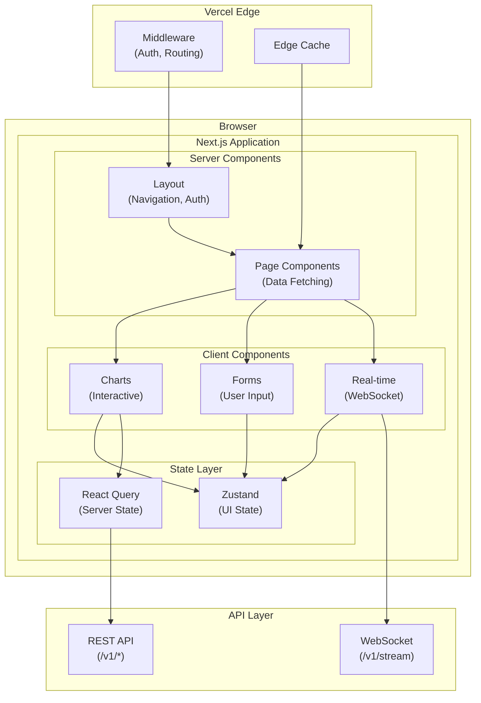
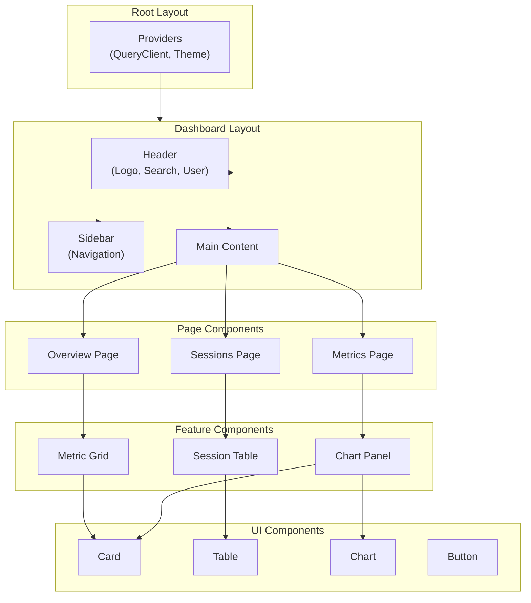

# AI Agent Analytics Platform - Frontend Architecture Specification

**Version:** 1.1.0  
**Status:** Technical Specification  
**Last Updated:** December 2025  
**Authors:** Technical Architecture Team

---

## Table of Contents

1. [Executive Summary](#1-executive-summary)
2. [MVP Scope & Phased Delivery](#2-mvp-scope--phased-delivery)
3. [Technology Stack](#3-technology-stack)
4. [Application Architecture](#4-application-architecture)
5. [Project Structure](#5-project-structure)
6. [Component Architecture](#6-component-architecture)
7. [State Management](#7-state-management)
8. [Data Fetching Strategy](#8-data-fetching-strategy)
9. [Real-Time Integration](#9-real-time-integration)
10. [Performance Optimization](#10-performance-optimization)
11. [Design System](#11-design-system)
12. [Testing Strategy](#12-testing-strategy)
13. [Implementation Checklist](#13-implementation-checklist)

---

## 1. Executive Summary

### 1.1 Purpose

This document defines the frontend architecture for the AI Agent Analytics Dashboard. It provides a comprehensive blueprint for building a performant, maintainable, and scalable React application using Next.js 14.

### 1.2 Key Requirements

From the PRD and user personas:

| Requirement | Target | Source |
|-------------|--------|--------|
| Initial page load | < 2 seconds | PRD Performance Requirements |
| Dashboard refresh | < 500ms | PRD Performance Requirements |
| Real-time updates | < 30s latency | System Architecture |
| Concurrent users | 1,000 | System Architecture |
| Mobile responsive | Yes | PRD Accessibility |
| Accessibility | WCAG 2.1 AA | PRD Accessibility |

### 1.3 User Personas

| Persona | Primary Views | Key Actions |
|---------|---------------|-------------|
| **Engineering Manager** | Executive dashboard, team metrics | Compare teams, export reports |
| **Lead Developer** | Session explorer, cost analysis | Drill into sessions, analyze errors |
| **DevOps Engineer** | Performance metrics, alerts | Monitor latency, configure alerts |
| **CTO** | Cost overview, security | Review spending, compliance |

### 1.4 Key Architectural Decisions

| Decision | Choice | Rationale |
|----------|--------|-----------|
| **Framework** | Next.js 14 (App Router) | RSC, streaming, edge runtime |
| **State Management** | Zustand + React Query | Simple, performant, server-state optimized |
| **Styling** | Tailwind CSS + shadcn/ui | Rapid development, consistent design |
| **Charts** | Recharts | React-native, composable, accessible |
| **Real-time** | Native WebSocket | Simple, efficient, full control |
| **Forms** | React Hook Form + Zod | Type-safe, performant validation |
| **Testing** | Vitest + Testing Library + Playwright | Fast, comprehensive coverage |

---

## 2. MVP Scope & Phased Delivery

### 13.1 Frontend Development Phases

```
┌─────────────────────────────────────────────────────────────────────────────┐
│                    Frontend Development Phases                               │
├─────────────────────────────────────────────────────────────────────────────┤
│                                                                             │
│  Phase 1: MVP (Weeks 1-6)                                                   │
│  ════════════════════════                                                   │
│  Goal: Core dashboard with essential functionality                          │
│  • Login / Authentication flow                                              │
│  • Dashboard overview (4 KPI cards + 2 charts)                             │
│  • Session list with basic filtering                                        │
│  • Session detail view                                                      │
│  • Date range picker (preset periods only)                                 │
│  • Basic responsive layout                                                  │
│                                                                             │
│  Phase 2: Completeness (Weeks 7-12)                                        │
│  ══════════════════════════════════                                        │
│  Goal: Full PRD feature parity                                             │
│  • Real-time WebSocket updates                                             │
│  • Advanced filtering (teams, agents, environments)                        │
│  • Session replay/timeline                                                  │
│  • Settings pages (API keys, profile)                                      │
│  • Alert configuration UI                                                  │
│  • Data export functionality                                               │
│                                                                             │
│  Phase 3: Polish & Scale (Weeks 13+)                                       │
│  ════════════════════════════════════                                      │
│  Goal: Enterprise-ready experience                                         │
│  • Custom date range picker                                                │
│  • Advanced visualizations                                                 │
│  • Team/user management UI                                                 │
│  • SSO configuration                                                       │
│  • Mobile app consideration                                                │
│  • Accessibility audit (WCAG AA)                                           │
│                                                                             │
└─────────────────────────────────────────────────────────────────────────────┘
```

### 13.2 Pages & Components by Phase

| Page / Component | Phase 1 (MVP) | Phase 2 | Phase 3 | Notes |
|------------------|:-------------:|:-------:|:-------:|-------|
| **Pages** ||||||
| /login | ✅ | | | Auth flow |
| /dashboard | ✅ | | | Overview |
| /sessions | ✅ | | | List view |
| /sessions/[id] | ✅ | | | Detail view |
| /sessions/[id]/replay | | ✅ | | Timeline replay |
| /metrics | | ✅ | | Deep analytics |
| /alerts | | ✅ | | Alert management |
| /settings | | ✅ | | Preferences |
| /settings/api-keys | | ✅ | | Key management |
| /settings/team | | | ✅ | Team management |
| /admin | | | ✅ | Admin features |
| **Components** ||||||
| MetricCard | ✅ | | | KPI display |
| LineChart / AreaChart | ✅ | | | Time series |
| BarChart | | ✅ | | Breakdowns |
| SessionTable | ✅ | | | Basic columns |
| SessionTable (advanced) | | ✅ | | All filters, sort |
| DateRangePicker (presets) | ✅ | | | 7d, 30d, 90d |
| DateRangePicker (custom) | | | ✅ | Calendar picker |
| FilterBar | | ✅ | | Multi-select filters |
| AlertBanner | | ✅ | | Real-time alerts |
| SessionTimeline | | ✅ | | Event replay |
| ExportDialog | | ✅ | | Data export |
| **Features** ||||||
| Authentication | ✅ JWT only | ✅ + Refresh | ✅ + SSO |
| Real-time updates | ❌ | ✅ WebSocket | ✅ + Reconnect |
| Caching | ✅ Basic | ✅ + Prefetch | ✅ + Offline |
| Error boundaries | ✅ | ✅ + Recovery | ✅ |
| Loading states | ✅ Skeleton | ✅ + Streaming | ✅ |
| Mobile responsive | ✅ Basic | ✅ Full | ✅ + Touch |
| Dark mode | ❌ | ✅ | ✅ |
| Accessibility | ✅ Basic | ✅ WCAG A | ✅ WCAG AA |

### 13.3 MVP Scope Boundaries

**In Scope for MVP (Phase 1):**
- Login page with Cognito integration
- Dashboard with 4 metric cards (DAU, Sessions, Success Rate, Est. Cost)
- Two charts: Sessions over time (line), Errors by type (bar)
- Session list with date filter and status filter
- Session detail with event list (no timeline visualization)
- Preset date ranges only (Last 7 days, Last 30 days, Last 90 days)
- Basic responsive layout (desktop-first, functional on tablet/mobile)
- Loading skeletons and basic error states
- Light mode only

**Explicitly Deferred to Phase 2+:**
- Real-time WebSocket updates (users will refresh)
- Session replay/timeline visualization
- Advanced filtering (by team, agent, environment)
- Alert configuration and notifications
- Settings pages
- Data export functionality
- Dark mode

**Explicitly Deferred to Phase 3+:**
- Custom date range calendar picker
- Team/user management UI
- SSO configuration pages
- Mobile-optimized interactions
- Full WCAG AA compliance audit
- Offline support / PWA

### 13.4 Component Priority Matrix

| Priority | Components | Reason |
|----------|------------|--------|
| **P0 - Must Have** | MetricCard, BasicChart, SessionTable, DatePresets, Layout, Auth | Core dashboard functionality |
| **P1 - Should Have** | FilterBar, SessionDetail, ErrorBoundary, LoadingSkeleton | Essential UX |
| **P2 - Nice to Have** | SessionTimeline, AlertBanner, ExportDialog, DarkMode | Enhanced features |
| **P3 - Future** | CustomDatePicker, TeamManager, AdminDashboard, PWA | Enterprise features |

---

## 3. Technology Stack

### 13.1 Core Technologies

```
┌─────────────────────────────────────────────────────────────────────────────┐
│                           Frontend Technology Stack                          │
├─────────────────────────────────────────────────────────────────────────────┤
│                                                                             │
│  Framework          Next.js 14.1+ (App Router)                              │
│  ├─ Runtime         Node.js 20 LTS                                          │
│  ├─ Language        TypeScript 5.3+                                         │
│  └─ React           React 18.3+                                             │
│                                                                             │
│  Styling            Tailwind CSS 3.4+                                       │
│  ├─ Components      shadcn/ui (Radix primitives)                            │
│  ├─ Icons           Lucide React                                            │
│  └─ Animations      Framer Motion                                           │
│                                                                             │
│  State              Zustand 4.5+ (client state)                             │
│  ├─ Server State    TanStack Query 5.x (React Query)                        │
│  └─ Forms           React Hook Form + Zod                                   │
│                                                                             │
│  Data Visualization Recharts 2.x                                            │
│  ├─ Tables          TanStack Table 8.x                                      │
│  └─ Date Picker     react-day-picker                                        │
│                                                                             │
│  Real-time          Native WebSocket + custom hooks                         │
│                                                                             │
│  Testing            Vitest + Testing Library + Playwright                   │
│                                                                             │
│  Build              Turborepo (monorepo)                                    │
│  ├─ Bundler         Turbopack (dev) / Webpack (prod)                        │
│  └─ Deployment      Vercel                                                  │
│                                                                             │
└─────────────────────────────────────────────────────────────────────────────┘
```

### 13.2 Dependency Versions

```json
{
  "dependencies": {
    "next": "^14.1.0",
    "react": "^18.3.0",
    "react-dom": "^18.3.0",
    
    "@tanstack/react-query": "^5.17.0",
    "@tanstack/react-table": "^8.11.0",
    "zustand": "^4.5.0",
    
    "tailwindcss": "^3.4.0",
    "@radix-ui/react-dialog": "^1.0.5",
    "@radix-ui/react-dropdown-menu": "^2.0.6",
    "@radix-ui/react-select": "^2.0.0",
    "@radix-ui/react-tabs": "^1.0.4",
    "class-variance-authority": "^0.7.0",
    "clsx": "^2.1.0",
    "tailwind-merge": "^2.2.0",
    "lucide-react": "^0.312.0",
    "framer-motion": "^11.0.0",
    
    "recharts": "^2.10.0",
    "react-day-picker": "^8.10.0",
    "date-fns": "^3.3.0",
    
    "react-hook-form": "^7.49.0",
    "@hookform/resolvers": "^3.3.0",
    "zod": "^3.22.0",
    
    "next-auth": "^5.0.0-beta.4"
  },
  "devDependencies": {
    "typescript": "^5.3.0",
    "@types/react": "^18.2.0",
    "@types/node": "^20.11.0",
    
    "vitest": "^1.2.0",
    "@testing-library/react": "^14.1.0",
    "@testing-library/jest-dom": "^6.2.0",
    "@playwright/test": "^1.41.0",
    
    "eslint": "^8.56.0",
    "eslint-config-next": "^14.1.0",
    "prettier": "^3.2.0",
    "prettier-plugin-tailwindcss": "^0.5.0"
  }
}
```

### 13.3 Technology Trade-off Analysis

#### State Management: Zustand vs Redux vs Jotai

| Criteria | Zustand | Redux Toolkit | Jotai |
|----------|---------|---------------|-------|
| Bundle size | 1.1 KB | 11 KB | 2.4 KB |
| Learning curve | Low | Medium | Low |
| DevTools | ✅ | ✅ (better) | ✅ |
| TypeScript | ✅ Excellent | ✅ Good | ✅ Excellent |
| Boilerplate | Minimal | Medium | Minimal |
| Server components | ✅ | ❌ | ✅ |

**Decision:** Zustand - Minimal boilerplate, excellent TypeScript support, works with RSC.

#### Charting: Recharts vs Chart.js vs Visx

| Criteria | Recharts | Chart.js | Visx |
|----------|----------|----------|------|
| React-native | ✅ Yes | ❌ Wrapper | ✅ Yes |
| Bundle size | 180 KB | 65 KB | 150 KB |
| Customization | High | Medium | Very High |
| Accessibility | Good | Limited | Excellent |
| Learning curve | Low | Low | High |

**Decision:** Recharts - Balance of customization and ease of use, fully React-native.

---

## 4. Application Architecture

### 13.1 High-Level Architecture



### 13.2 Rendering Strategy

| Page | Strategy | Reason |
|------|----------|--------|
| `/login` | Static | No dynamic data |
| `/dashboard` | Dynamic SSR | Personalized, real-time |
| `/sessions` | Dynamic SSR + Streaming | List with filters |
| `/sessions/[id]` | Dynamic SSR | Session-specific |
| `/settings` | Static + Client | User preferences |
| `/docs/*` | Static (ISR) | Documentation |

### 13.3 Data Flow Architecture

```
┌─────────────────────────────────────────────────────────────────────────────┐
│                              Data Flow                                       │
├─────────────────────────────────────────────────────────────────────────────┤
│                                                                             │
│  1. INITIAL LOAD (SSR)                                                      │
│     ┌──────────┐    ┌──────────┐    ┌──────────┐    ┌──────────┐          │
│     │  Request │───▶│ Middleware│───▶│  Server  │───▶│  Render  │          │
│     │          │    │  (Auth)  │    │Component │    │  HTML    │          │
│     └──────────┘    └──────────┘    └──────────┘    └──────────┘          │
│                                           │                                 │
│                                           ▼                                 │
│                                    ┌──────────┐                            │
│                                    │   API    │                            │
│                                    │  Fetch   │                            │
│                                    └──────────┘                            │
│                                                                             │
│  2. CLIENT HYDRATION                                                        │
│     ┌──────────┐    ┌──────────┐    ┌──────────┐                          │
│     │  Hydrate │───▶│  React   │───▶│ WebSocket│                          │
│     │   HTML   │    │  Query   │    │ Connect  │                          │
│     └──────────┘    └──────────┘    └──────────┘                          │
│                                                                             │
│  3. REAL-TIME UPDATES                                                       │
│     ┌──────────┐    ┌──────────┐    ┌──────────┐    ┌──────────┐          │
│     │WebSocket │───▶│  Zustand │───▶│  React   │───▶│    UI    │          │
│     │ Message  │    │  Store   │    │  Render  │    │  Update  │          │
│     └──────────┘    └──────────┘    └──────────┘    └──────────┘          │
│                                                                             │
│  4. USER INTERACTION                                                        │
│     ┌──────────┐    ┌──────────┐    ┌──────────┐    ┌──────────┐          │
│     │  User    │───▶│  Zustand │───▶│  React   │───▶│   API    │          │
│     │  Action  │    │  Update  │    │  Query   │    │ Mutation │          │
│     └──────────┘    └──────────┘    └──────────┘    └──────────┘          │
│                                                                             │
└─────────────────────────────────────────────────────────────────────────────┘
```

---

## 5. Project Structure

### 13.1 Directory Structure

```
apps/
└── dashboard/
    ├── app/                          # Next.js App Router
    │   ├── (auth)/                   # Auth route group (no layout)
    │   │   ├── login/
    │   │   │   └── page.tsx
    │   │   ├── callback/
    │   │   │   └── page.tsx
    │   │   └── layout.tsx
    │   │
    │   ├── (dashboard)/              # Dashboard route group (with layout)
    │   │   ├── layout.tsx            # Dashboard shell (nav, sidebar)
    │   │   ├── page.tsx              # /dashboard (overview)
    │   │   ├── loading.tsx           # Loading UI
    │   │   ├── error.tsx             # Error boundary
    │   │   │
    │   │   ├── sessions/
    │   │   │   ├── page.tsx          # Session list
    │   │   │   ├── [id]/
    │   │   │   │   ├── page.tsx      # Session detail
    │   │   │   │   └── loading.tsx
    │   │   │   └── loading.tsx
    │   │   │
    │   │   ├── metrics/
    │   │   │   ├── page.tsx          # Metrics overview
    │   │   │   ├── performance/
    │   │   │   │   └── page.tsx
    │   │   │   ├── cost/
    │   │   │   │   └── page.tsx
    │   │   │   └── security/
    │   │   │       └── page.tsx
    │   │   │
    │   │   ├── settings/
    │   │   │   ├── page.tsx          # General settings
    │   │   │   ├── team/
    │   │   │   │   └── page.tsx
    │   │   │   ├── api-keys/
    │   │   │   │   └── page.tsx
    │   │   │   └── billing/
    │   │   │       └── page.tsx
    │   │   │
    │   │   └── alerts/
    │   │       └── page.tsx
    │   │
    │   ├── api/                      # API routes (if needed)
    │   │   └── auth/
    │   │       └── [...nextauth]/
    │   │           └── route.ts
    │   │
    │   ├── layout.tsx                # Root layout
    │   ├── globals.css               # Global styles
    │   └── providers.tsx             # Client providers wrapper
    │
    ├── components/
    │   ├── ui/                       # Base UI components (shadcn)
    │   │   ├── button.tsx
    │   │   ├── card.tsx
    │   │   ├── dialog.tsx
    │   │   ├── dropdown-menu.tsx
    │   │   ├── input.tsx
    │   │   ├── select.tsx
    │   │   ├── table.tsx
    │   │   ├── tabs.tsx
    │   │   └── toast.tsx
    │   │
    │   ├── layout/                   # Layout components
    │   │   ├── header.tsx
    │   │   ├── sidebar.tsx
    │   │   ├── nav-links.tsx
    │   │   ├── user-menu.tsx
    │   │   └── mobile-nav.tsx
    │   │
    │   ├── dashboard/                # Dashboard-specific components
    │   │   ├── metric-card.tsx
    │   │   ├── metric-chart.tsx
    │   │   ├── activity-feed.tsx
    │   │   ├── quick-stats.tsx
    │   │   └── overview-grid.tsx
    │   │
    │   ├── sessions/                 # Session components
    │   │   ├── session-table.tsx
    │   │   ├── session-filters.tsx
    │   │   ├── session-detail.tsx
    │   │   ├── session-timeline.tsx
    │   │   └── session-replay.tsx
    │   │
    │   ├── charts/                   # Chart components
    │   │   ├── area-chart.tsx
    │   │   ├── bar-chart.tsx
    │   │   ├── line-chart.tsx
    │   │   ├── pie-chart.tsx
    │   │   ├── sparkline.tsx
    │   │   └── chart-tooltip.tsx
    │   │
    │   ├── filters/                  # Filter components
    │   │   ├── date-range-picker.tsx
    │   │   ├── team-filter.tsx
    │   │   ├── agent-filter.tsx
    │   │   ├── environment-filter.tsx
    │   │   └── filter-bar.tsx
    │   │
    │   └── shared/                   # Shared components
    │       ├── loading-spinner.tsx
    │       ├── error-boundary.tsx
    │       ├── empty-state.tsx
    │       ├── status-badge.tsx
    │       ├── avatar.tsx
    │       └── time-ago.tsx
    │
    ├── lib/
    │   ├── api/                      # API client
    │   │   ├── client.ts             # Base fetch client
    │   │   ├── events.ts             # Events API
    │   │   ├── metrics.ts            # Metrics API
    │   │   ├── sessions.ts           # Sessions API
    │   │   └── types.ts              # API types
    │   │
    │   ├── hooks/                    # Custom hooks
    │   │   ├── use-metrics.ts
    │   │   ├── use-sessions.ts
    │   │   ├── use-websocket.ts
    │   │   ├── use-filters.ts
    │   │   ├── use-debounce.ts
    │   │   └── use-local-storage.ts
    │   │
    │   ├── stores/                   # Zustand stores
    │   │   ├── ui-store.ts           # UI state (sidebar, modals)
    │   │   ├── filter-store.ts       # Global filters
    │   │   ├── realtime-store.ts     # Real-time data
    │   │   └── index.ts
    │   │
    │   ├── utils/                    # Utilities
    │   │   ├── cn.ts                 # Class name helper
    │   │   ├── format.ts             # Formatters
    │   │   ├── date.ts               # Date utilities
    │   │   └── constants.ts
    │   │
    │   └── auth/                     # Auth utilities
    │       ├── config.ts             # NextAuth config
    │       └── middleware.ts
    │
    ├── types/                        # TypeScript types
    │   ├── api.ts                    # API response types
    │   ├── models.ts                 # Domain models
    │   └── global.d.ts
    │
    ├── public/                       # Static assets
    │   ├── logo.svg
    │   └── favicon.ico
    │
    ├── tailwind.config.ts
    ├── next.config.js
    ├── tsconfig.json
    └── package.json
```

### 13.2 Import Aliases

```typescript
// tsconfig.json
{
  "compilerOptions": {
    "baseUrl": ".",
    "paths": {
      "@/*": ["./*"],
      "@/components/*": ["components/*"],
      "@/lib/*": ["lib/*"],
      "@/hooks/*": ["lib/hooks/*"],
      "@/stores/*": ["lib/stores/*"],
      "@/types/*": ["types/*"]
    }
  }
}

// Usage
import { Button } from '@/components/ui/button';
import { useMetrics } from '@/hooks/use-metrics';
import { useFilterStore } from '@/stores/filter-store';
import type { Session } from '@/types/models';
```

---

## 6. Component Architecture

### 13.1 Component Hierarchy



### 13.2 Component Categories

| Category | Server/Client | Purpose | Examples |
|----------|---------------|---------|----------|
| **Layout** | Server | Page structure | Header, Sidebar, Footer |
| **Page** | Server | Route entry points | Dashboard, Sessions |
| **Feature** | Client | Business logic | MetricGrid, SessionTable |
| **UI** | Client | Reusable primitives | Button, Card, Input |
| **Chart** | Client | Data visualization | LineChart, BarChart |
| **Form** | Client | User input | FilterBar, SettingsForm |

### 13.3 Component Patterns

#### Server Component (Data Fetching)

```tsx
// app/(dashboard)/page.tsx
import { Suspense } from 'react';
import { getMetricsOverview } from '@/lib/api/metrics';
import { MetricGrid } from '@/components/dashboard/metric-grid';
import { MetricGridSkeleton } from '@/components/dashboard/metric-grid-skeleton';
import { ActivityFeed } from '@/components/dashboard/activity-feed';

export default async function DashboardPage() {
  // Server-side data fetching
  const metrics = await getMetricsOverview({ period: '7d' });
  
  return (
    <div className="space-y-6">
      <header>
        <h1 className="text-2xl font-bold">Dashboard</h1>
        <p className="text-muted-foreground">
          Overview of your AI agent analytics
        </p>
      </header>
      
      {/* Server component with pre-fetched data */}
      <MetricGrid initialData={metrics} />
      
      {/* Streaming with Suspense boundary */}
      <Suspense fallback={<ActivityFeedSkeleton />}>
        <ActivityFeed />
      </Suspense>
    </div>
  );
}
```

#### Client Component (Interactivity)

```tsx
// components/dashboard/metric-grid.tsx
'use client';

import { useMetrics } from '@/hooks/use-metrics';
import { useFilterStore } from '@/stores/filter-store';
import { useRealtimeStore } from '@/stores/realtime-store';
import { MetricCard } from './metric-card';
import type { MetricsOverview } from '@/types/api';

interface MetricGridProps {
  initialData: MetricsOverview;
}

export function MetricGrid({ initialData }: MetricGridProps) {
  const { dateRange, team } = useFilterStore();
  const realtimeMetrics = useRealtimeStore((state) => state.metrics);
  
  // React Query with SSR hydration
  const { data: metrics, isLoading } = useMetrics({
    period: dateRange,
    team,
    initialData,
  });
  
  // Merge server data with real-time updates
  const displayMetrics = {
    ...metrics,
    ...realtimeMetrics,
  };
  
  return (
    <div className="grid grid-cols-1 gap-4 sm:grid-cols-2 lg:grid-cols-4">
      <MetricCard
        title="Active Users"
        value={displayMetrics.active_users.value}
        change={displayMetrics.active_users.change_percent}
        trend={displayMetrics.active_users.trend}
        icon="users"
      />
      <MetricCard
        title="Total Sessions"
        value={displayMetrics.total_sessions.value}
        change={displayMetrics.total_sessions.change_percent}
        trend={displayMetrics.total_sessions.trend}
        icon="activity"
      />
      <MetricCard
        title="Success Rate"
        value={displayMetrics.success_rate.value}
        change={displayMetrics.success_rate.change_percent}
        trend={displayMetrics.success_rate.trend}
        format="percent"
        icon="check-circle"
      />
      <MetricCard
        title="Est. Cost"
        value={displayMetrics.total_cost.value}
        change={displayMetrics.total_cost.change_percent}
        trend={displayMetrics.total_cost.trend}
        format="currency"
        icon="dollar-sign"
      />
    </div>
  );
}
```

#### Compound Component Pattern

```tsx
// components/ui/card.tsx
import { cn } from '@/lib/utils/cn';

interface CardProps extends React.HTMLAttributes<HTMLDivElement> {}

function Card({ className, ...props }: CardProps) {
  return (
    <div
      className={cn(
        'rounded-lg border bg-card text-card-foreground shadow-sm',
        className
      )}
      {...props}
    />
  );
}

function CardHeader({ className, ...props }: CardProps) {
  return (
    <div
      className={cn('flex flex-col space-y-1.5 p-6', className)}
      {...props}
    />
  );
}

function CardTitle({ className, ...props }: React.HTMLAttributes<HTMLHeadingElement>) {
  return (
    <h3
      className={cn('text-2xl font-semibold leading-none tracking-tight', className)}
      {...props}
    />
  );
}

function CardContent({ className, ...props }: CardProps) {
  return <div className={cn('p-6 pt-0', className)} {...props} />;
}

export { Card, CardHeader, CardTitle, CardContent };

// Usage
<Card>
  <CardHeader>
    <CardTitle>Active Users</CardTitle>
  </CardHeader>
  <CardContent>
    <div className="text-4xl font-bold">1,247</div>
  </CardContent>
</Card>
```

---

## 7. State Management

### 13.1 State Categories

```
┌─────────────────────────────────────────────────────────────────────────────┐
│                           State Management Strategy                          │
├─────────────────────────────────────────────────────────────────────────────┤
│                                                                             │
│  ┌─────────────────┐  ┌─────────────────┐  ┌─────────────────┐            │
│  │   Server State  │  │   Client State  │  │   URL State     │            │
│  │  (React Query)  │  │   (Zustand)     │  │  (searchParams) │            │
│  ├─────────────────┤  ├─────────────────┤  ├─────────────────┤            │
│  │ • API responses │  │ • UI state      │  │ • Filters       │            │
│  │ • Cached data   │  │ • Modals        │  │ • Pagination    │            │
│  │ • Mutations     │  │ • Sidebar       │  │ • Sort order    │            │
│  │ • Pagination    │  │ • Theme         │  │ • Tab selection │            │
│  │ • Optimistic    │  │ • Real-time     │  │                 │            │
│  └─────────────────┘  └─────────────────┘  └─────────────────┘            │
│                                                                             │
│  Use When:           Use When:            Use When:                        │
│  • Data from API     • No persistence     • Shareable URLs                 │
│  • Needs caching     • Component-local    • Browser history                │
│  • Background sync   • Global UI state    • Bookmarkable                   │
│                                                                             │
└─────────────────────────────────────────────────────────────────────────────┘
```

### 13.2 Zustand Stores

#### UI Store

```typescript
// lib/stores/ui-store.ts
import { create } from 'zustand';
import { persist } from 'zustand/middleware';

interface UIState {
  // Sidebar
  sidebarOpen: boolean;
  sidebarCollapsed: boolean;
  
  // Modals
  activeModal: string | null;
  modalData: Record<string, unknown>;
  
  // Theme
  theme: 'light' | 'dark' | 'system';
  
  // Actions
  toggleSidebar: () => void;
  setSidebarCollapsed: (collapsed: boolean) => void;
  openModal: (modal: string, data?: Record<string, unknown>) => void;
  closeModal: () => void;
  setTheme: (theme: 'light' | 'dark' | 'system') => void;
}

export const useUIStore = create<UIState>()(
  persist(
    (set) => ({
      sidebarOpen: true,
      sidebarCollapsed: false,
      activeModal: null,
      modalData: {},
      theme: 'system',
      
      toggleSidebar: () => set((state) => ({ sidebarOpen: !state.sidebarOpen })),
      setSidebarCollapsed: (collapsed) => set({ sidebarCollapsed: collapsed }),
      openModal: (modal, data = {}) => set({ activeModal: modal, modalData: data }),
      closeModal: () => set({ activeModal: null, modalData: {} }),
      setTheme: (theme) => set({ theme }),
    }),
    {
      name: 'ui-store',
      partialize: (state) => ({
        sidebarCollapsed: state.sidebarCollapsed,
        theme: state.theme,
      }),
    }
  )
);
```

#### Filter Store

```typescript
// lib/stores/filter-store.ts
import { create } from 'zustand';
import { startOfDay, endOfDay, subDays } from 'date-fns';

interface DateRange {
  from: Date;
  to: Date;
  preset: '1d' | '7d' | '30d' | '90d' | 'custom';
}

interface FilterState {
  dateRange: DateRange;
  teams: string[];
  agents: string[];
  environments: string[];
  status: string[];
  
  // Actions
  setDateRange: (range: DateRange) => void;
  setDatePreset: (preset: DateRange['preset']) => void;
  setTeams: (teams: string[]) => void;
  setAgents: (agents: string[]) => void;
  setEnvironments: (environments: string[]) => void;
  setStatus: (status: string[]) => void;
  resetFilters: () => void;
}

const getPresetRange = (preset: DateRange['preset']): Omit<DateRange, 'preset'> => {
  const now = new Date();
  switch (preset) {
    case '1d':
      return { from: startOfDay(now), to: endOfDay(now) };
    case '7d':
      return { from: startOfDay(subDays(now, 7)), to: endOfDay(now) };
    case '30d':
      return { from: startOfDay(subDays(now, 30)), to: endOfDay(now) };
    case '90d':
      return { from: startOfDay(subDays(now, 90)), to: endOfDay(now) };
    default:
      return { from: startOfDay(subDays(now, 7)), to: endOfDay(now) };
  }
};

const initialState = {
  dateRange: { ...getPresetRange('7d'), preset: '7d' as const },
  teams: [],
  agents: [],
  environments: [],
  status: [],
};

export const useFilterStore = create<FilterState>()((set) => ({
  ...initialState,
  
  setDateRange: (range) => set({ dateRange: range }),
  setDatePreset: (preset) => set({ 
    dateRange: { ...getPresetRange(preset), preset } 
  }),
  setTeams: (teams) => set({ teams }),
  setAgents: (agents) => set({ agents }),
  setEnvironments: (environments) => set({ environments }),
  setStatus: (status) => set({ status }),
  resetFilters: () => set(initialState),
}));
```

#### Real-time Store

```typescript
// lib/stores/realtime-store.ts
import { create } from 'zustand';
import type { MetricUpdate, SessionEvent, Alert } from '@/types/api';

interface RealtimeState {
  // Connection status
  connected: boolean;
  lastUpdate: Date | null;
  
  // Real-time data
  metrics: Partial<Record<string, MetricUpdate>>;
  activeSessions: Map<string, SessionEvent>;
  alerts: Alert[];
  
  // Actions
  setConnected: (connected: boolean) => void;
  updateMetric: (metric: MetricUpdate) => void;
  addSession: (session: SessionEvent) => void;
  removeSession: (sessionId: string) => void;
  addAlert: (alert: Alert) => void;
  dismissAlert: (alertId: string) => void;
  clearAll: () => void;
}

export const useRealtimeStore = create<RealtimeState>()((set) => ({
  connected: false,
  lastUpdate: null,
  metrics: {},
  activeSessions: new Map(),
  alerts: [],
  
  setConnected: (connected) => set({ connected }),
  
  updateMetric: (metric) => set((state) => ({
    metrics: { ...state.metrics, [metric.name]: metric },
    lastUpdate: new Date(),
  })),
  
  addSession: (session) => set((state) => {
    const newSessions = new Map(state.activeSessions);
    newSessions.set(session.session_id, session);
    return { activeSessions: newSessions, lastUpdate: new Date() };
  }),
  
  removeSession: (sessionId) => set((state) => {
    const newSessions = new Map(state.activeSessions);
    newSessions.delete(sessionId);
    return { activeSessions: newSessions };
  }),
  
  addAlert: (alert) => set((state) => ({
    alerts: [alert, ...state.alerts].slice(0, 50), // Keep last 50
    lastUpdate: new Date(),
  })),
  
  dismissAlert: (alertId) => set((state) => ({
    alerts: state.alerts.filter((a) => a.id !== alertId),
  })),
  
  clearAll: () => set({
    metrics: {},
    activeSessions: new Map(),
    alerts: [],
    lastUpdate: null,
  }),
}));
```

### 13.3 React Query Configuration

```typescript
// lib/api/query-client.ts
import { QueryClient } from '@tanstack/react-query';

export const queryClient = new QueryClient({
  defaultOptions: {
    queries: {
      // Stale time: how long data is considered fresh
      staleTime: 30 * 1000, // 30 seconds
      
      // Cache time: how long to keep inactive data
      gcTime: 5 * 60 * 1000, // 5 minutes
      
      // Retry configuration
      retry: 3,
      retryDelay: (attemptIndex) => Math.min(1000 * 2 ** attemptIndex, 30000),
      
      // Refetch on window focus for fresh data
      refetchOnWindowFocus: true,
      
      // Don't refetch on mount if data is fresh
      refetchOnMount: false,
    },
    mutations: {
      // Retry mutations once
      retry: 1,
    },
  },
});

// app/providers.tsx
'use client';

import { QueryClientProvider } from '@tanstack/react-query';
import { ReactQueryDevtools } from '@tanstack/react-query-devtools';
import { queryClient } from '@/lib/api/query-client';

export function Providers({ children }: { children: React.ReactNode }) {
  return (
    <QueryClientProvider client={queryClient}>
      {children}
      <ReactQueryDevtools initialIsOpen={false} />
    </QueryClientProvider>
  );
}
```

---

## 8. Data Fetching Strategy

### 13.1 API Client

```typescript
// lib/api/client.ts
import { getSession } from 'next-auth/react';

const API_BASE_URL = process.env.NEXT_PUBLIC_API_URL || 'https://api.analytics.example.com/v1';

interface FetchOptions extends RequestInit {
  params?: Record<string, string | number | boolean | undefined>;
}

class APIError extends Error {
  constructor(
    public status: number,
    public code: string,
    message: string,
    public details?: Record<string, unknown>
  ) {
    super(message);
    this.name = 'APIError';
  }
}

async function getAuthHeader(): Promise<Record<string, string>> {
  // Server-side
  if (typeof window === 'undefined') {
    const { cookies } = await import('next/headers');
    const sessionToken = cookies().get('next-auth.session-token')?.value;
    if (sessionToken) {
      return { Cookie: `next-auth.session-token=${sessionToken}` };
    }
    return {};
  }
  
  // Client-side
  const session = await getSession();
  if (session?.accessToken) {
    return { Authorization: `Bearer ${session.accessToken}` };
  }
  return {};
}

export async function apiClient<T>(
  endpoint: string,
  options: FetchOptions = {}
): Promise<T> {
  const { params, ...fetchOptions } = options;
  
  // Build URL with query params
  const url = new URL(`${API_BASE_URL}${endpoint}`);
  if (params) {
    Object.entries(params).forEach(([key, value]) => {
      if (value !== undefined) {
        url.searchParams.set(key, String(value));
      }
    });
  }
  
  // Get auth header
  const authHeader = await getAuthHeader();
  
  // Make request
  const response = await fetch(url.toString(), {
    ...fetchOptions,
    headers: {
      'Content-Type': 'application/json',
      ...authHeader,
      ...fetchOptions.headers,
    },
  });
  
  // Handle response
  const data = await response.json();
  
  if (!response.ok) {
    throw new APIError(
      response.status,
      data.error?.code || 'UNKNOWN_ERROR',
      data.error?.message || 'An error occurred',
      data.error?.details
    );
  }
  
  return data as T;
}

// Typed API methods
export const api = {
  get: <T>(endpoint: string, params?: FetchOptions['params']) =>
    apiClient<T>(endpoint, { method: 'GET', params }),
  
  post: <T>(endpoint: string, body?: unknown) =>
    apiClient<T>(endpoint, {
      method: 'POST',
      body: body ? JSON.stringify(body) : undefined,
    }),
  
  put: <T>(endpoint: string, body?: unknown) =>
    apiClient<T>(endpoint, {
      method: 'PUT',
      body: body ? JSON.stringify(body) : undefined,
    }),
  
  delete: <T>(endpoint: string) =>
    apiClient<T>(endpoint, { method: 'DELETE' }),
};
```

### 13.2 Query Hooks

```typescript
// lib/hooks/use-metrics.ts
import { useQuery, useQueryClient } from '@tanstack/react-query';
import { api } from '@/lib/api/client';
import { useFilterStore } from '@/stores/filter-store';
import type { MetricsOverviewResponse, MetricsTimeseriesResponse } from '@/types/api';

// Query keys factory
export const metricsKeys = {
  all: ['metrics'] as const,
  overview: (params: { period: string; compare?: boolean }) =>
    [...metricsKeys.all, 'overview', params] as const,
  timeseries: (params: { metric: string; period: string; granularity?: string }) =>
    [...metricsKeys.all, 'timeseries', params] as const,
  breakdown: (params: { metric: string; dimension: string; period: string }) =>
    [...metricsKeys.all, 'breakdown', params] as const,
};

// Overview metrics hook
interface UseMetricsOptions {
  initialData?: MetricsOverviewResponse;
  enabled?: boolean;
}

export function useMetricsOverview(options: UseMetricsOptions = {}) {
  const { dateRange } = useFilterStore();
  const period = dateRange.preset;
  
  return useQuery({
    queryKey: metricsKeys.overview({ period, compare: true }),
    queryFn: () => api.get<MetricsOverviewResponse>('/metrics/overview', {
      period,
      compare: true,
    }),
    initialData: options.initialData,
    enabled: options.enabled ?? true,
    staleTime: 10 * 1000, // 10 seconds for real-time feel
    refetchInterval: 30 * 1000, // Refetch every 30 seconds
  });
}

// Timeseries metrics hook
interface UseTimeseriesOptions {
  metric: string;
  granularity?: 'hour' | 'day' | 'week';
  enabled?: boolean;
}

export function useMetricsTimeseries({ metric, granularity = 'day', enabled = true }: UseTimeseriesOptions) {
  const { dateRange } = useFilterStore();
  const period = dateRange.preset;
  
  return useQuery({
    queryKey: metricsKeys.timeseries({ metric, period, granularity }),
    queryFn: () => api.get<MetricsTimeseriesResponse>('/metrics/timeseries', {
      metric,
      period,
      granularity,
    }),
    enabled,
    staleTime: 60 * 1000, // 1 minute
  });
}

// Prefetch helper for server components
export async function prefetchMetricsOverview(
  queryClient: ReturnType<typeof useQueryClient>,
  period: string
) {
  await queryClient.prefetchQuery({
    queryKey: metricsKeys.overview({ period, compare: true }),
    queryFn: () => api.get<MetricsOverviewResponse>('/metrics/overview', {
      period,
      compare: true,
    }),
  });
}
```

```typescript
// lib/hooks/use-sessions.ts
import { useQuery, useInfiniteQuery, useMutation, useQueryClient } from '@tanstack/react-query';
import { api } from '@/lib/api/client';
import { useFilterStore } from '@/stores/filter-store';
import type { SessionListResponse, SessionDetail, SessionEventsResponse } from '@/types/api';

export const sessionKeys = {
  all: ['sessions'] as const,
  lists: () => [...sessionKeys.all, 'list'] as const,
  list: (filters: Record<string, unknown>) => [...sessionKeys.lists(), filters] as const,
  details: () => [...sessionKeys.all, 'detail'] as const,
  detail: (id: string) => [...sessionKeys.details(), id] as const,
  events: (id: string) => [...sessionKeys.detail(id), 'events'] as const,
};

// Session list with infinite scroll
export function useSessionsInfinite() {
  const { dateRange, teams, agents, environments, status } = useFilterStore();
  
  return useInfiniteQuery({
    queryKey: sessionKeys.list({
      dateRange: dateRange.preset,
      teams,
      agents,
      environments,
      status,
    }),
    queryFn: ({ pageParam }) =>
      api.get<SessionListResponse>('/sessions', {
        start_time: dateRange.from.toISOString(),
        end_time: dateRange.to.toISOString(),
        status: status.join(',') || undefined,
        agent_id: agents.join(',') || undefined,
        cursor: pageParam,
        limit: 25,
      }),
    initialPageParam: undefined as string | undefined,
    getNextPageParam: (lastPage) =>
      lastPage.pagination.has_more ? lastPage.pagination.cursor : undefined,
    staleTime: 30 * 1000,
  });
}

// Session detail
export function useSession(sessionId: string) {
  return useQuery({
    queryKey: sessionKeys.detail(sessionId),
    queryFn: () => api.get<SessionDetail>(`/sessions/${sessionId}`),
    enabled: !!sessionId,
    staleTime: 60 * 1000,
  });
}

// Session events (for replay)
export function useSessionEvents(sessionId: string) {
  return useInfiniteQuery({
    queryKey: sessionKeys.events(sessionId),
    queryFn: ({ pageParam }) =>
      api.get<SessionEventsResponse>(`/sessions/${sessionId}/events`, {
        cursor: pageParam,
        limit: 100,
      }),
    initialPageParam: undefined as string | undefined,
    getNextPageParam: (lastPage) =>
      lastPage.pagination.has_more ? lastPage.pagination.cursor : undefined,
    enabled: !!sessionId,
    staleTime: 5 * 60 * 1000, // Sessions don't change once ended
  });
}
```

### 13.3 Server Component Data Fetching

```typescript
// app/(dashboard)/sessions/page.tsx
import { Suspense } from 'react';
import { dehydrate, HydrationBoundary, QueryClient } from '@tanstack/react-query';
import { api } from '@/lib/api/client';
import { sessionKeys } from '@/hooks/use-sessions';
import { SessionTable } from '@/components/sessions/session-table';
import { SessionFilters } from '@/components/sessions/session-filters';
import { SessionTableSkeleton } from '@/components/sessions/session-table-skeleton';

interface PageProps {
  searchParams: {
    status?: string;
    agent?: string;
    from?: string;
    to?: string;
  };
}

export default async function SessionsPage({ searchParams }: PageProps) {
  const queryClient = new QueryClient();
  
  // Prefetch initial data on server
  await queryClient.prefetchQuery({
    queryKey: sessionKeys.list({ ...searchParams }),
    queryFn: () => api.get('/sessions', {
      status: searchParams.status,
      agent_id: searchParams.agent,
      start_time: searchParams.from,
      end_time: searchParams.to,
      limit: 25,
    }),
  });
  
  return (
    <div className="space-y-6">
      <header className="flex items-center justify-between">
        <div>
          <h1 className="text-2xl font-bold">Sessions</h1>
          <p className="text-muted-foreground">
            View and analyze agent sessions
          </p>
        </div>
      </header>
      
      <SessionFilters />
      
      <HydrationBoundary state={dehydrate(queryClient)}>
        <Suspense fallback={<SessionTableSkeleton />}>
          <SessionTable />
        </Suspense>
      </HydrationBoundary>
    </div>
  );
}
```

---

## 9. Real-Time Integration

### 13.1 WebSocket Hook

```typescript
// lib/hooks/use-websocket.ts
import { useEffect, useRef, useCallback } from 'react';
import { useSession } from 'next-auth/react';
import { useRealtimeStore } from '@/stores/realtime-store';

interface WebSocketMessage {
  type: string;
  channel: string;
  timestamp: string;
  data: unknown;
}

interface UseWebSocketOptions {
  channels: string[];
  enabled?: boolean;
  onMessage?: (message: WebSocketMessage) => void;
}

export function useWebSocket({
  channels,
  enabled = true,
  onMessage,
}: UseWebSocketOptions) {
  const { data: session } = useSession();
  const wsRef = useRef<WebSocket | null>(null);
  const reconnectTimeoutRef = useRef<NodeJS.Timeout>();
  const reconnectAttemptsRef = useRef(0);
  
  const { setConnected, updateMetric, addSession, removeSession, addAlert } = useRealtimeStore();
  
  const handleMessage = useCallback((event: MessageEvent) => {
    try {
      const message: WebSocketMessage = JSON.parse(event.data);
      
      // Handle different message types
      switch (message.type) {
        case 'metrics:update':
          updateMetric(message.data as any);
          break;
        case 'session:started':
          addSession(message.data as any);
          break;
        case 'session:ended':
          removeSession((message.data as any).session_id);
          break;
        case 'alert:triggered':
          addAlert(message.data as any);
          break;
        case 'pong':
          // Heartbeat response
          break;
      }
      
      // Custom handler
      onMessage?.(message);
    } catch (error) {
      console.error('WebSocket message parse error:', error);
    }
  }, [updateMetric, addSession, removeSession, addAlert, onMessage]);
  
  const connect = useCallback(() => {
    if (!session?.accessToken || !enabled) return;
    
    const wsUrl = `${process.env.NEXT_PUBLIC_WS_URL}/v1/stream?token=${session.accessToken}`;
    const ws = new WebSocket(wsUrl);
    
    ws.onopen = () => {
      console.log('WebSocket connected');
      setConnected(true);
      reconnectAttemptsRef.current = 0;
      
      // Subscribe to channels
      ws.send(JSON.stringify({
        type: 'subscribe',
        channels,
      }));
      
      // Start heartbeat
      const heartbeat = setInterval(() => {
        if (ws.readyState === WebSocket.OPEN) {
          ws.send(JSON.stringify({ type: 'ping', timestamp: Date.now() }));
        }
      }, 30000);
      
      ws.addEventListener('close', () => clearInterval(heartbeat));
    };
    
    ws.onmessage = handleMessage;
    
    ws.onclose = (event) => {
      console.log('WebSocket closed:', event.code, event.reason);
      setConnected(false);
      
      // Reconnect with exponential backoff
      if (enabled && reconnectAttemptsRef.current < 5) {
        const delay = Math.min(1000 * 2 ** reconnectAttemptsRef.current, 30000);
        reconnectTimeoutRef.current = setTimeout(() => {
          reconnectAttemptsRef.current++;
          connect();
        }, delay);
      }
    };
    
    ws.onerror = (error) => {
      console.error('WebSocket error:', error);
    };
    
    wsRef.current = ws;
  }, [session?.accessToken, enabled, channels, setConnected, handleMessage]);
  
  // Connect on mount
  useEffect(() => {
    connect();
    
    return () => {
      clearTimeout(reconnectTimeoutRef.current);
      wsRef.current?.close();
    };
  }, [connect]);
  
  // Send message helper
  const send = useCallback((data: unknown) => {
    if (wsRef.current?.readyState === WebSocket.OPEN) {
      wsRef.current.send(JSON.stringify(data));
    }
  }, []);
  
  return { send };
}
```

### 13.2 Real-Time Dashboard Integration

```tsx
// components/dashboard/realtime-provider.tsx
'use client';

import { useWebSocket } from '@/hooks/use-websocket';
import { useRealtimeStore } from '@/stores/realtime-store';

export function RealtimeProvider({ children }: { children: React.ReactNode }) {
  // Connect to WebSocket with default channels
  useWebSocket({
    channels: ['metrics:overview', 'sessions:active', 'alerts:critical'],
    enabled: true,
  });
  
  return <>{children}</>;
}

// components/dashboard/connection-status.tsx
'use client';

import { useRealtimeStore } from '@/stores/realtime-store';
import { cn } from '@/lib/utils/cn';

export function ConnectionStatus() {
  const { connected, lastUpdate } = useRealtimeStore();
  
  return (
    <div className="flex items-center gap-2 text-sm">
      <span
        className={cn(
          'h-2 w-2 rounded-full',
          connected ? 'bg-green-500' : 'bg-red-500'
        )}
      />
      <span className="text-muted-foreground">
        {connected ? 'Live' : 'Disconnected'}
      </span>
      {lastUpdate && (
        <span className="text-muted-foreground">
          · Updated {formatDistanceToNow(lastUpdate, { addSuffix: true })}
        </span>
      )}
    </div>
  );
}

// components/dashboard/live-metric.tsx
'use client';

import { useRealtimeStore } from '@/stores/realtime-store';
import { motion, AnimatePresence } from 'framer-motion';

interface LiveMetricProps {
  name: string;
  fallbackValue: number;
  format?: (value: number) => string;
}

export function LiveMetric({ name, fallbackValue, format = String }: LiveMetricProps) {
  const realtimeValue = useRealtimeStore((state) => state.metrics[name]?.value);
  const value = realtimeValue ?? fallbackValue;
  
  return (
    <AnimatePresence mode="wait">
      <motion.span
        key={value}
        initial={{ opacity: 0, y: -10 }}
        animate={{ opacity: 1, y: 0 }}
        exit={{ opacity: 0, y: 10 }}
        transition={{ duration: 0.2 }}
      >
        {format(value)}
      </motion.span>
    </AnimatePresence>
  );
}
```

### 13.3 Live Activity Feed

```tsx
// components/dashboard/activity-feed.tsx
'use client';

import { useRealtimeStore } from '@/stores/realtime-store';
import { formatDistanceToNow } from 'date-fns';
import { Avatar } from '@/components/ui/avatar';
import { Badge } from '@/components/ui/badge';
import { motion, AnimatePresence } from 'framer-motion';

export function ActivityFeed() {
  const activeSessions = useRealtimeStore((state) => 
    Array.from(state.activeSessions.values())
  );
  const alerts = useRealtimeStore((state) => state.alerts);
  
  // Merge and sort by timestamp
  const activities = [
    ...activeSessions.map((s) => ({ ...s, type: 'session' as const })),
    ...alerts.map((a) => ({ ...a, type: 'alert' as const })),
  ].sort((a, b) => 
    new Date(b.timestamp).getTime() - new Date(a.timestamp).getTime()
  ).slice(0, 10);
  
  return (
    <div className="space-y-4">
      <h3 className="font-semibold">Live Activity</h3>
      
      <div className="space-y-3">
        <AnimatePresence>
          {activities.map((activity) => (
            <motion.div
              key={activity.type === 'session' ? activity.session_id : activity.id}
              initial={{ opacity: 0, x: -20 }}
              animate={{ opacity: 1, x: 0 }}
              exit={{ opacity: 0, x: 20 }}
              className="flex items-center gap-3 rounded-lg border p-3"
            >
              {activity.type === 'session' ? (
                <>
                  <Avatar
                    name={activity.user_name}
                    size="sm"
                  />
                  <div className="flex-1 min-w-0">
                    <p className="text-sm font-medium truncate">
                      {activity.user_name}
                    </p>
                    <p className="text-xs text-muted-foreground">
                      Started session with {activity.agent_id}
                    </p>
                  </div>
                  <Badge variant="outline">Active</Badge>
                </>
              ) : (
                <>
                  <div
                    className={cn(
                      'h-8 w-8 rounded-full flex items-center justify-center',
                      activity.severity === 'critical' ? 'bg-red-100' : 'bg-yellow-100'
                    )}
                  >
                    <AlertTriangle
                      className={cn(
                        'h-4 w-4',
                        activity.severity === 'critical' ? 'text-red-600' : 'text-yellow-600'
                      )}
                    />
                  </div>
                  <div className="flex-1 min-w-0">
                    <p className="text-sm font-medium truncate">
                      {activity.title}
                    </p>
                    <p className="text-xs text-muted-foreground">
                      {activity.message}
                    </p>
                  </div>
                  <Badge variant={activity.severity === 'critical' ? 'destructive' : 'warning'}>
                    {activity.severity}
                  </Badge>
                </>
              )}
              
              <span className="text-xs text-muted-foreground whitespace-nowrap">
                {formatDistanceToNow(new Date(activity.timestamp), { addSuffix: true })}
              </span>
            </motion.div>
          ))}
        </AnimatePresence>
        
        {activities.length === 0 && (
          <p className="text-center text-muted-foreground py-8">
            No recent activity
          </p>
        )}
      </div>
    </div>
  );
}
```

---

## 10. Performance Optimization

### 13.1 Performance Budget

| Metric | Target | Tool |
|--------|--------|------|
| **LCP** (Largest Contentful Paint) | < 2.5s | Core Web Vitals |
| **FID** (First Input Delay) | < 100ms | Core Web Vitals |
| **CLS** (Cumulative Layout Shift) | < 0.1 | Core Web Vitals |
| **TTI** (Time to Interactive) | < 3.8s | Lighthouse |
| **Bundle Size (Initial)** | < 150 KB | webpack-bundle-analyzer |
| **Bundle Size (Total)** | < 500 KB | webpack-bundle-analyzer |

### 13.2 Optimization Strategies

#### Code Splitting

```typescript
// Dynamic imports for heavy components
import dynamic from 'next/dynamic';

// Chart components (lazy load)
const AreaChart = dynamic(
  () => import('@/components/charts/area-chart').then((mod) => mod.AreaChart),
  {
    loading: () => <ChartSkeleton />,
    ssr: false, // Charts don't need SSR
  }
);

// Session replay (heavy, lazy load)
const SessionReplay = dynamic(
  () => import('@/components/sessions/session-replay'),
  {
    loading: () => <ReplaySkeleton />,
  }
);

// Date picker (only when needed)
const DateRangePicker = dynamic(
  () => import('@/components/filters/date-range-picker'),
  { ssr: false }
);
```

#### Image Optimization

```tsx
// Use Next.js Image component
import Image from 'next/image';

function UserAvatar({ user }: { user: User }) {
  return (
    <Image
      src={user.avatar_url}
      alt={user.name}
      width={40}
      height={40}
      className="rounded-full"
      placeholder="blur"
      blurDataURL={AVATAR_PLACEHOLDER}
    />
  );
}
```

#### Virtualization for Long Lists

```tsx
// components/sessions/session-table.tsx
import { useVirtualizer } from '@tanstack/react-virtual';

function SessionTable({ sessions }: { sessions: Session[] }) {
  const parentRef = useRef<HTMLDivElement>(null);
  
  const virtualizer = useVirtualizer({
    count: sessions.length,
    getScrollElement: () => parentRef.current,
    estimateSize: () => 60, // Row height
    overscan: 10,
  });
  
  return (
    <div ref={parentRef} className="h-[600px] overflow-auto">
      <div
        style={{
          height: `${virtualizer.getTotalSize()}px`,
          width: '100%',
          position: 'relative',
        }}
      >
        {virtualizer.getVirtualItems().map((virtualRow) => (
          <div
            key={virtualRow.key}
            style={{
              position: 'absolute',
              top: 0,
              left: 0,
              width: '100%',
              height: `${virtualRow.size}px`,
              transform: `translateY(${virtualRow.start}px)`,
            }}
          >
            <SessionRow session={sessions[virtualRow.index]} />
          </div>
        ))}
      </div>
    </div>
  );
}
```

#### Memoization

```tsx
// Memoize expensive computations
import { useMemo, memo } from 'react';

const SessionMetrics = memo(function SessionMetrics({
  sessions,
}: {
  sessions: Session[];
}) {
  const metrics = useMemo(() => {
    return {
      total: sessions.length,
      active: sessions.filter((s) => s.status === 'active').length,
      avgDuration: sessions.reduce((acc, s) => acc + (s.duration || 0), 0) / sessions.length,
      successRate: sessions.filter((s) => s.status === 'completed').length / sessions.length * 100,
    };
  }, [sessions]);
  
  return (
    <div className="grid grid-cols-4 gap-4">
      {/* Render metrics */}
    </div>
  );
});
```

### 13.3 Caching Strategy

```typescript
// next.config.js
module.exports = {
  // Enable ISR for static pages
  experimental: {
    isrMemoryCacheSize: 50 * 1024 * 1024, // 50 MB
  },
  
  // Cache headers
  async headers() {
    return [
      {
        source: '/_next/static/:path*',
        headers: [
          {
            key: 'Cache-Control',
            value: 'public, max-age=31536000, immutable',
          },
        ],
      },
      {
        source: '/api/:path*',
        headers: [
          {
            key: 'Cache-Control',
            value: 'private, no-cache, no-store, must-revalidate',
          },
        ],
      },
    ];
  },
};

// React Query cache configuration
const queryClient = new QueryClient({
  defaultOptions: {
    queries: {
      staleTime: 30 * 1000,
      gcTime: 5 * 60 * 1000,
      
      // Persist to localStorage for offline support
      persister: createSyncStoragePersister({
        storage: window.localStorage,
      }),
    },
  },
});
```

---

## 11. Design System

### 13.1 Color Palette

```css
/* tailwind.config.ts - Design tokens */
const colors = {
  // Brand colors
  primary: {
    50: '#eff6ff',
    100: '#dbeafe',
    500: '#3b82f6',
    600: '#2563eb',
    700: '#1d4ed8',
  },
  
  // Semantic colors
  success: {
    50: '#f0fdf4',
    500: '#22c55e',
    700: '#15803d',
  },
  warning: {
    50: '#fffbeb',
    500: '#f59e0b',
    700: '#b45309',
  },
  error: {
    50: '#fef2f2',
    500: '#ef4444',
    700: '#b91c1c',
  },
  
  // Chart colors (accessible palette)
  chart: {
    1: '#3b82f6', // Blue
    2: '#22c55e', // Green
    3: '#f59e0b', // Amber
    4: '#8b5cf6', // Purple
    5: '#ec4899', // Pink
    6: '#06b6d4', // Cyan
  },
};
```

### 13.2 Typography Scale

```typescript
// tailwind.config.ts
const fontSize = {
  xs: ['0.75rem', { lineHeight: '1rem' }],
  sm: ['0.875rem', { lineHeight: '1.25rem' }],
  base: ['1rem', { lineHeight: '1.5rem' }],
  lg: ['1.125rem', { lineHeight: '1.75rem' }],
  xl: ['1.25rem', { lineHeight: '1.75rem' }],
  '2xl': ['1.5rem', { lineHeight: '2rem' }],
  '3xl': ['1.875rem', { lineHeight: '2.25rem' }],
  '4xl': ['2.25rem', { lineHeight: '2.5rem' }],
};
```

### 13.3 Component Variants (CVA)

```typescript
// components/ui/button.tsx
import { cva, type VariantProps } from 'class-variance-authority';

const buttonVariants = cva(
  // Base styles
  'inline-flex items-center justify-center rounded-md text-sm font-medium transition-colors focus-visible:outline-none focus-visible:ring-2 focus-visible:ring-ring disabled:pointer-events-none disabled:opacity-50',
  {
    variants: {
      variant: {
        default: 'bg-primary text-primary-foreground hover:bg-primary/90',
        destructive: 'bg-destructive text-destructive-foreground hover:bg-destructive/90',
        outline: 'border border-input bg-background hover:bg-accent hover:text-accent-foreground',
        secondary: 'bg-secondary text-secondary-foreground hover:bg-secondary/80',
        ghost: 'hover:bg-accent hover:text-accent-foreground',
        link: 'text-primary underline-offset-4 hover:underline',
      },
      size: {
        default: 'h-10 px-4 py-2',
        sm: 'h-9 rounded-md px-3',
        lg: 'h-11 rounded-md px-8',
        icon: 'h-10 w-10',
      },
    },
    defaultVariants: {
      variant: 'default',
      size: 'default',
    },
  }
);

interface ButtonProps
  extends React.ButtonHTMLAttributes<HTMLButtonElement>,
    VariantProps<typeof buttonVariants> {
  asChild?: boolean;
}

const Button = React.forwardRef<HTMLButtonElement, ButtonProps>(
  ({ className, variant, size, asChild = false, ...props }, ref) => {
    const Comp = asChild ? Slot : 'button';
    return (
      <Comp
        className={cn(buttonVariants({ variant, size, className }))}
        ref={ref}
        {...props}
      />
    );
  }
);
```

### 13.4 Responsive Breakpoints

```typescript
// tailwind.config.ts
const screens = {
  sm: '640px',   // Mobile landscape
  md: '768px',   // Tablet
  lg: '1024px',  // Desktop
  xl: '1280px',  // Large desktop
  '2xl': '1536px', // Extra large
};

// Usage
<div className="grid grid-cols-1 sm:grid-cols-2 lg:grid-cols-4 gap-4">
  {/* Responsive grid */}
</div>
```

---

## 12. Testing Strategy

### 13.1 Testing Pyramid

```
                    ┌─────────────┐
                    │     E2E     │  5%  - Critical user flows
                    │ (Playwright)│
                    ├─────────────┤
                    │ Integration │  25% - Component interactions
                    │  (Vitest)   │
                    ├─────────────┤
                    │    Unit     │  70% - Utilities, hooks
                    │  (Vitest)   │
                    └─────────────┘
```

### 13.2 Unit Tests

```typescript
// lib/utils/format.test.ts
import { describe, it, expect } from 'vitest';
import { formatNumber, formatCurrency, formatPercent } from './format';

describe('formatNumber', () => {
  it('formats thousands with K suffix', () => {
    expect(formatNumber(1500)).toBe('1.5K');
    expect(formatNumber(10000)).toBe('10K');
  });
  
  it('formats millions with M suffix', () => {
    expect(formatNumber(1500000)).toBe('1.5M');
  });
  
  it('handles small numbers without suffix', () => {
    expect(formatNumber(999)).toBe('999');
  });
});

describe('formatCurrency', () => {
  it('formats USD with dollar sign', () => {
    expect(formatCurrency(1234.56)).toBe('$1,234.56');
  });
  
  it('handles zero', () => {
    expect(formatCurrency(0)).toBe('$0.00');
  });
});
```

### 13.3 Component Tests

```typescript
// components/dashboard/metric-card.test.tsx
import { describe, it, expect, vi } from 'vitest';
import { render, screen } from '@testing-library/react';
import { MetricCard } from './metric-card';

describe('MetricCard', () => {
  it('renders metric value and title', () => {
    render(
      <MetricCard
        title="Active Users"
        value={1247}
        change={4.88}
        trend="up"
      />
    );
    
    expect(screen.getByText('Active Users')).toBeInTheDocument();
    expect(screen.getByText('1,247')).toBeInTheDocument();
  });
  
  it('shows positive change with green indicator', () => {
    render(
      <MetricCard
        title="Active Users"
        value={1247}
        change={4.88}
        trend="up"
      />
    );
    
    const changeElement = screen.getByText('+4.88%');
    expect(changeElement).toHaveClass('text-green-600');
  });
  
  it('shows negative change with red indicator', () => {
    render(
      <MetricCard
        title="Errors"
        value={234}
        change={-18.47}
        trend="down"
      />
    );
    
    const changeElement = screen.getByText('-18.47%');
    expect(changeElement).toHaveClass('text-red-600');
  });
});
```

### 13.4 Hook Tests

```typescript
// lib/hooks/use-metrics.test.tsx
import { describe, it, expect, vi, beforeEach } from 'vitest';
import { renderHook, waitFor } from '@testing-library/react';
import { QueryClient, QueryClientProvider } from '@tanstack/react-query';
import { useMetricsOverview } from './use-metrics';
import { api } from '@/lib/api/client';

vi.mock('@/lib/api/client');

const wrapper = ({ children }: { children: React.ReactNode }) => (
  <QueryClientProvider client={new QueryClient()}>
    {children}
  </QueryClientProvider>
);

describe('useMetricsOverview', () => {
  beforeEach(() => {
    vi.resetAllMocks();
  });
  
  it('fetches and returns metrics data', async () => {
    const mockData = {
      metrics: {
        active_users: { value: 1247, change_percent: 4.88, trend: 'up' },
      },
    };
    
    vi.mocked(api.get).mockResolvedValueOnce(mockData);
    
    const { result } = renderHook(() => useMetricsOverview(), { wrapper });
    
    await waitFor(() => {
      expect(result.current.isSuccess).toBe(true);
    });
    
    expect(result.current.data).toEqual(mockData);
  });
  
  it('uses initial data when provided', () => {
    const initialData = {
      metrics: {
        active_users: { value: 1000, change_percent: 0, trend: 'stable' },
      },
    };
    
    const { result } = renderHook(
      () => useMetricsOverview({ initialData }),
      { wrapper }
    );
    
    expect(result.current.data).toEqual(initialData);
  });
});
```

### 13.5 E2E Tests

```typescript
// e2e/dashboard.spec.ts
import { test, expect } from '@playwright/test';

test.describe('Dashboard', () => {
  test.beforeEach(async ({ page }) => {
    // Login
    await page.goto('/login');
    await page.fill('[name="email"]', 'test@example.com');
    await page.fill('[name="password"]', 'password');
    await page.click('button[type="submit"]');
    await page.waitForURL('/dashboard');
  });
  
  test('displays overview metrics', async ({ page }) => {
    await expect(page.getByText('Active Users')).toBeVisible();
    await expect(page.getByText('Total Sessions')).toBeVisible();
    await expect(page.getByText('Success Rate')).toBeVisible();
    await expect(page.getByText('Est. Cost')).toBeVisible();
  });
  
  test('filters by date range', async ({ page }) => {
    await page.click('[data-testid="date-range-picker"]');
    await page.click('text=Last 30 days');
    
    // Verify URL updated
    await expect(page).toHaveURL(/period=30d/);
    
    // Verify metrics updated (check for loading state first)
    await expect(page.getByTestId('metric-card-loading')).not.toBeVisible();
  });
  
  test('navigates to session detail', async ({ page }) => {
    await page.goto('/dashboard/sessions');
    
    // Click first session row
    await page.click('[data-testid="session-row"]:first-child');
    
    // Verify navigation
    await expect(page).toHaveURL(/\/sessions\/sess_/);
    await expect(page.getByText('Session Details')).toBeVisible();
  });
  
  test('receives real-time updates', async ({ page }) => {
    // Get initial value
    const initialValue = await page.getByTestId('active-users-value').textContent();
    
    // Wait for WebSocket update (mock or wait)
    await page.waitForTimeout(35000); // Wait for 30s update cycle
    
    // Value should potentially change (or we verify WebSocket connected)
    await expect(page.getByTestId('connection-status')).toHaveText('Live');
  });
});
```

---

## 13. Implementation Checklist

### 13.1 Phase 1: Foundation (Week 1-2)

| Task | Status | Priority |
|------|--------|----------|
| Project setup (Next.js 14, TypeScript, Tailwind) | ⬜ | P0 |
| shadcn/ui component installation | ⬜ | P0 |
| Authentication flow (NextAuth) | ⬜ | P0 |
| API client setup | ⬜ | P0 |
| React Query configuration | ⬜ | P0 |
| Zustand stores (UI, filters) | ⬜ | P0 |
| Dashboard layout (header, sidebar) | ⬜ | P0 |
| Basic routing structure | ⬜ | P0 |

### 13.2 Phase 2: Core Features (Week 3-4)

| Task | Status | Priority |
|------|--------|----------|
| Dashboard overview page | ⬜ | P0 |
| Metric cards component | ⬜ | P0 |
| Line/Area charts | ⬜ | P0 |
| Date range picker | ⬜ | P0 |
| Sessions list page | ⬜ | P0 |
| Session table with pagination | ⬜ | P0 |
| Session detail page | ⬜ | P0 |
| Filter bar component | ⬜ | P0 |

### 13.3 Phase 3: Real-Time & Polish (Week 5-6)

| Task | Status | Priority |
|------|--------|----------|
| WebSocket integration | ⬜ | P1 |
| Real-time metric updates | ⬜ | P1 |
| Live activity feed | ⬜ | P1 |
| Alert notifications | ⬜ | P1 |
| Session timeline/replay | ⬜ | P1 |
| Settings pages | ⬜ | P1 |
| Mobile responsive polish | ⬜ | P1 |
| Performance optimization | ⬜ | P1 |
| Unit/integration tests | ⬜ | P1 |
| E2E tests | ⬜ | P2 |

---

## Document History

| Version | Date | Author | Changes |
|---------|------|--------|---------|
| 1.0.0 | Dec 2025 | Tech Team | Initial specification |
| 1.1.0 | Dec 2025 | Tech Team | Added MVP scope & phased delivery, component priority matrix |

---

**Next Steps:**
1. Set up project repository with monorepo structure
2. Install and configure base dependencies
3. Implement authentication flow
4. Build first dashboard prototype
